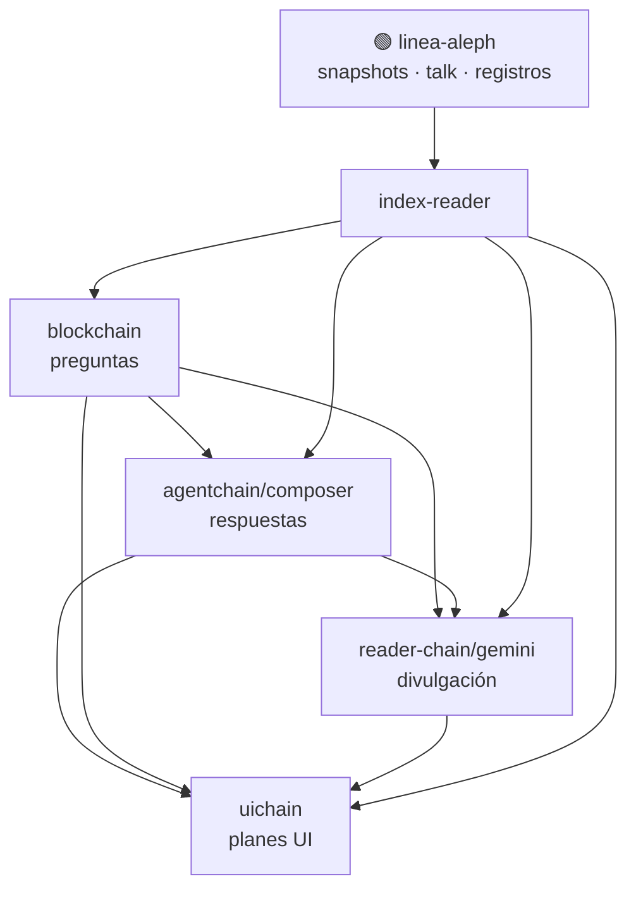

# Poder: ayuda

## Propósito

Orientación **opt-in** para index-reader: (1) mapa de capas blockchain / agentchain / gemini / uichain; (2) tabla ultra-resumen de bloques para Widget Tramas–Story Board. No sustituye lectura forense ni genera UI uichain.

Manifest estático para Widget B: [`solve-coagula-story-board.json`](../../../../data/sessions/solve-coagula-story-board.json) — regenerar con [`story_board_manifest.py`](../../../../scripts/story_board_manifest.py).

**Canon datos Story Board:** mapa actos (Q5), chips subtrama y metadatos por bloque viven en **este SKILL + JSON** — no en prompts uichain. Los `.prompt.md` de uichain describen solo **visualización, UX y DevOps**; leen JSON/SKILL en render, no duplican tablas.

## Cuándo se activa

- `default_on: false` (opt-in).
- Requiere traje puesto.
- Shortcut: `+ayuda` / `-ayuda` (alias opcional: `+help`).
- Disparadores: inicio de sesión si el usuario pide orientación, `+ayuda`, «mapa de capas», «qué es blockchain/agentchain/gemini/uichain», «story board», «ultra-resumen bloques».

## Comportamiento

### Función 1 — Mapa de capas (help)

Emitir plantilla fija (tablas + topología mermaid). Marcar como tejido de ayuda (`> **Ayuda capas**` o 🔴 mínimo); **no** 🟢.

**Reglas:**
- No repetir TOC entero del juego; white-paper abstracto.
- Si el turno mezcla ayuda + forense (`selective-query`): bloque ayuda **antes** del cuerpo forense.
- Gemini cadena: bloques **1–4** (+ mapa de capas vía este poder, no gemini-10). *Gemini 5+ pendiente de alineación post-rediseño blockchain 11–15.*

#### Contraste de capas

| Dimensión | **blockchain** | **agentchain** | **gemini** | **uichain** |
|-----------|----------------|----------------|------------|-------------|
| **Rol** | Fundación secuencial | Inferencia y análisis | Narrativa y enrutamiento | Interfaz generativa |
| **Unidad** | Bloque = pregunta usuario | Bloque = respuesta del modelo | Bloque = acto de lectura | `.prompt.md` / plan DevOps |
| **Metáfora** | Libro · páginas | Crónica forense · prensa | Baile en pista · compás DevOps | Scrollytelling · tablero · timeline |
| **Marca dominante** | Pregunta canónica (no 🟢 wiki) | 🟡 fuente de inferencia | 🟡 cita + 🔴 glosa mínima | Especificación (no verdad) |
| **Mutabilidad** | Solo vía plan (añadir/fork) | Carpeta por modelo (`composer/`) | Cadena paralela del reader | Aleph abierto; sin UI fija |

| Capa | Una frase |
|------|-----------|
| **blockchain** | *Qué se preguntó* y en qué orden se construyó el juego. |
| **agentchain** | *Qué concluyó cada modelo* (análisis, prensa, infra). |
| **gemini** | *Cómo se cuenta* al visitante del libro vivo. |
| **uichain** | *Cómo se vería* — molde generativo, no pantalla cerrada. |

#### Topología



**Flujo:** usuario → `blockchain` (prompt) → `agentchain` (forense + propuesta UI) → `gemini` (cita 🟡, prioriza 🟢) → `uichain` (layout de sesión, no determinista).

#### Índice por cadena (muestra)

| Cadena | Alcance | Hitos |
|--------|---------|-------|
| **blockchain** | Bloques 0–15 | Ledger de `# User`; acto cierre 11–15 (contrato, vestuario, dual, fantasma, epílogo) |
| **agentchain/composer** | Bloques 2–15 | Corpus · REIC · pulso oct–nov · Matrix · prensa · talk-cache · alineación ±24 h |
| **reader-chain/gemini** | Bloques 1–4 | Intro traje · ayuda · anglo · REIC manual de campo — ver [`README.md`](../../../../../scriptorium-network-games/SOLVE_ET_COAGULA/reader-chain/gemini/README.md) |

#### Correspondencia gemini ↔ blockchain (temática)

| gemini N | Acto reader | Blockchain relacionada |
|----------|-------------|------------------------|
| 1 | Onboarding traje | 0–1 |
| 2 | Demo `+ayuda` | todos (Story Board Q1–Q5) |
| 3 | Épica anglo / Bunge | 5–6 (radiografía) |
| 4 | Protocolo REIC / manual de campo | 4 |
| 5+ | pendiente | 5 … 15 según roadmap README gemini |
| **uichain** | 3 prompts | `ui-block-6-recap` · `block-12-panel-estado` · `block-14-timeline-dual` |

| Tema | blockchain | agentchain | gemini | uichain |
|------|------------|------------|--------|---------|
| Contrato lectura | 11 | 11 | ⚪ (5+ pendiente) | — |
| Vestuario UT | 12 | 12 | ⚪ (5+ pendiente) | `block-12-panel-estado` Widget A |
| Dual artículo↔talk | 13 | 13 | ⚪ (5+ pendiente) | `block-14-timeline-dual` |
| Sala fantasma | 14 | 14 | ⚪ (5+ pendiente) | — |
| Epílogo SC | 15 | 15 | ⚪ (5+ pendiente) | `block-12-panel-estado` Widget B |

*Gemini 5+ pendiente de alineación post-rediseño; temas blockchain 11–15 cubiertos en agentchain/composer. Gemini 4 = REIC (vigente).*

**Síntesis:** `blockchain` → *qué*; `agentchain` → *conclusión*; `gemini` → *relato*; `uichain` → *vista*. Todo bajo `index-reader`, con 🟢 en caché y 🟡 en inferencias — nunca al revés.

### Función 2 — Extracción ultra-resumen (Story Board)

Leer metadatos reales de las cadenas (~1 lectura por bloque, solo cabecera `# User` en blockchain).

| Query | Ruta | Extrae |
|-------|------|--------|
| Q1 | `scriptorium-network-games/SOLVE_ET_COAGULA/blockchain/block-{N}.md` | Primera línea `# User` → ultra-resumen pregunta |
| Q2 | `agentchain/composer/block-{N}.md` | `present: true/false` |
| Q3 | `reader-chain/gemini/block-{N}.md` | `present: true/false` |
| Q4 | `uichain/*block-{N}*` | planes UI asociados (lista rutas o ⚪) |
| Q5 | Mapa actos (tabla fija abajo) | acto 0–4 por N |

#### Mapa actos (Q5)

| Acto | id | Bloques | Etiqueta |
|------|----|---------|----------|
| 0 | constitucion | 0–4 | Constitución |
| 1 | radiografia | 5–7 | Radiografía |
| 2 | friccion | 8 | Fricción |
| 3 | profundizacion | 9–10 | Profundización |
| 4 | cierre | 11–15 | Cierre |

Bloques 11–15: subtramas `talk_cache` (12–14), `epilogo` (15), `dual_reader` (13–14).

#### Subtramas (chips widget)

| Chip | Bloques | id |
|------|---------|-----|
| Matrix | 9–10 | matrix |
| Noviembre/Analiza | 8 | noviembre_analiza |
| Dual reader | 13–14 | dual_reader |
| Talk-cache | 12–14 | talk_cache |
| Epílogo | 15 | epilogo |

Heurística: asignar chips por N y keywords del bloque leído. Widget B uichain ([`block-12-panel-estado.prompt.md`](../../../../../scriptorium-network-games/SOLVE_ET_COAGULA/uichain/block-12-panel-estado.prompt.md)) consume estos datos en render — no los redefine.

#### Formato de salida runtime

Tras Función 1 (si aplica), emitir tabla:

```text
| N | Acto | Ultra-resumen (blockchain) | composer | gemini | uichain | chips |
```

- Archivo faltante → `⚪` en celda; **no inventar** bloque.
- Ultra-resumen: primera línea tras `# User` (truncar ~80 chars si larga); texto plano o ruta repo relativa `blockchain/block-N.md`.
- **Prohibido** `file://` y rutas absolutas (`C:/Users/...`, `file:///c:/...`).
- `composer` / `gemini`: `✓` si presente, `⚪` si ausente.
- `uichain`: nombres de prompt o `⚪`.
- `chips`: lista separada por `·` o `—`.

**DRY en sesión:** si [`reader-chain/gemini/block-2.md`](../../../../../scriptorium-network-games/SOLVE_ET_COAGULA/reader-chain/gemini/block-2.md) ya existe y el usuario no pidió `+ayuda refresh` ni «actualiza story board»: emitir versión **compacta** (mapa capas en 3 líneas + «tabla completa en gemini block-2»), no volcar 0–15 otra vez.

Alternativa: leer [`solve-coagula-story-board.json`](../../../../data/sessions/solve-coagula-story-board.json) si existe y el turno pide solo story board estático.

## Checklist específico

- ¿La ayuda va en bloque separado (🔴/bloque quote) y no mezcla 🟢 forense?
- ¿Cada ultra-resumen cita la ruta `blockchain/block-N.md` leída?
- ¿Celdas sin archivo muestran ⚪, no contenido inventado?
- ¿Gemini se cuenta 1–4 vigentes, no 1–10?
- ¿Tabla sin `file://` ni rutas absolutas?
- ¿DRY: gemini block-2 ya persistido → no repetir tabla completa sin `+ayuda refresh`?

## Ejemplo en cabecera

```
Composer · traje:puesto · poderes:cache-nav,...,ayuda · +poder <id> · -poder <id> · sin disfraz
```

## Qué NO es

- No sustituye [`modo-aleph`](../../modo-aleph/SKILL.md) ni renderiza UI uichain.
- No es narrativa gemini persistente — el mapa de capas vive aquí, no en `reader-chain/gemini/block-10.md` (descartado).
- No marca 🟢 en tablas de orientación.
