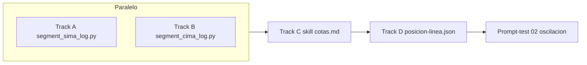

# Plan multitask — `sima-aleph` + `cima-aleph` + cotas del skill

## Tesis

La **línea** (`linea-aleph`) es la espina dorsal de demarcación (historial WP, deltas, registros).

Oscila entre dos **cotas** que acotan el tablero Aleph:

| Cota | Corpus | Función | Metáfora |
|------|--------|---------|----------|
| **Mínima** | `sima-aleph/` | Ruptura, discrepancia, **Eigenstate sin colapsar** | Sima: abismo donde coexisten polos irreconciliables |
| **Máxima** | `cima-aleph/` | Confluencia, reunión, **objetividad sistémica** | Cima: punto donde ontología mínima + gnosis operativa se encuentran |

El agente no elige sima **o** cima: **ubica la semilla** en el arco entre ambas al intentar posicionarse.

```
                    CIMA (confluencia)
                         ▲
                         │  objetividad sistémica
                         │  Gödel (suelo) + Cohen (motor)
    linea-aleph ─────────┼─────────► tiempo / demarcación
    (espina dorsal)      │
                         │  discrepancia / superposición
                         ▼
                    SIMA (ruptura)
                         Eigenstate / no colapsar
```

**¿Es viable?** Sí, si:
1. Ambos corpus se indexan como `logs-aleph` (escenas + manifest).
2. El skill `modo-aleph` añade **protocolo de oscilación** (no nuevos polos).
3. `aleph-context/` guarda la **posición en el arco** (`posicion-linea.json`), no recalcula todo cada sesión.

---

## Fuentes actuales

| Carpeta | Archivo | Líneas | Formato |
|---------|---------|--------|---------|
| `sima-aleph/` | `log-agent-1.md` | ~1139 | Prompt plano + `Interpretation:` / `We need to` (think) + output |
| `cima-aleph/` | `log-agent-1.md` | ~709 | Prompt + think `Analyze` (×3) + tool traces + output |

**Acción previa recomendada:** mover o copiar a `raw/log-agent-1.md` en cada carpeta (autocontención como `logs-aleph/`).

---

## Track A — `sima-aleph` (subagente 1)

### Objetivo
Corpus de **ruptura**: economía política (Rallo/Marx), Ethereum, HiperIPL, Gaia, zigurat, cuatro arquitecturas de la voz.

### Segmentador: `segment_sima_log.py`

**Marcadores de turno:** bloques que empiezan por prompt de usuario (línea sin prefijo tras output anterior) + `Interpretation:` / `We need to` como inicio de think.

**Capas:**

| Capa | Contenido |
|------|-----------|
| `prompt.md` | Petición usuario |
| `think.md` | `Interpretation:` + `We need to...` |
| `output.md` | Respuesta sustantiva (desde `###` o prosa larga) |
| `trace.md` | `Search is unavailable`, avisos operativos |

### Escenas propuestas (~10)

| ID | Slug | Tema | Rol cota |
|----|------|------|----------|
| s01-01 | `01-rallo-vs-capital` | Contraste Rallo / El Capital | Discrepancia valor subjetivo vs social |
| s01-02 | `02-tabla-cuatro-columnas` | Marx / Rallo / Ethereum / LLM | Tres polos + objetividad |
| s01-03 | `03-objetividad-llm-columna4` | Diseño posicionamiento LLM | Proto-objetividad sistémica |
| s01-04 | `04-vocabulario-cristiano-parabolas` | Crítica cruzada Rallo/Marx/Ethereum | Teología como tercer eje |
| s01-05 | `05-hiperplaza-ethereum-foos` | Espejo eclesial / asamblea | Ruptura institucional |
| s01-06 | `06-artefacto-hiperipl` | Informe ejecutivo HiperIPL | Formalización de voces |
| s01-07 | `07-addendas-gobernanza` | Parámetros, fork, desconexión | Discrepancia gobernanza |
| s01-08 | `08-bakunin-proudhon-hiperipl` | Anarquismo vs HiperIPL | Otra línea rota |
| s01-09 | `09-gaia-hiperipl` | Gaia como marco crítico | Bifurcación termodinámica |
| s01-10 | `10-zigurat-centro-vacio` | Cuatro arquitecturas de la voz | **Escena ancla sima** — no colapsar el centro |

### Entregables Track A
- `sima-aleph/manifest.json`, `INDICE.md`
- Tag transversal en manifest: `"cota": "sima"`, `"rol": "ruptura|discrepancia|eigenstate"`

---

## Track B — `cima-aleph` (subagente 2)

### Objetivo
Corpus de **confluencia**: ontología + gnoseología unificadas; Gödel/Cohen/Cantor; IA 1956–hoy.

### Segmentador: `segment_cima_log.py`

**Marcadores:** turnos por prompt usuario (líneas cortas iniciales); think = bloques `N. **Analyze` hasta output en español.

**Capas:** igual que `logs-aleph` (`prompt`, `think`, `output`, `trace` para Found/Read).

### Escenas propuestas (~4–5)

| ID | Slug | Tema | Rol cota |
|----|------|------|----------|
| s01-01 | `01-ontologia-gnoseologia-juntos` | Referentes, hoja de ruta | Confluencia inicial |
| s01-02 | `02-polarizacion-ontologia-gnoseologia` | ¿Es normal ignorar uno? | Crítica al falso dilema |
| s01-03 | `03-godel-cohen-cantor-diamat` | Minimalismo ontológico dinámico | **Escena ancla cima** — suelo + motor |
| s01-04 | `04-clasificacion-ia-ont-gnose` | Dartmouth → hoy, % híbrido | Mapa ecosistema 60/25/15 |

### Entregables Track B
- `cima-aleph/manifest.json`, `INDICE.md`
- Tag: `"cota": "cima"`, `"rol": "confluencia|reunion|objetividad-sistemica"`

---

## Track C — Integración skill (tras A + B)

### Archivos a tocar

| Archivo | Cambio |
|---------|--------|
| `agents/skills/modo-aleph/SKILL.md` | Añadir § **Oscilación sima–cima–linea** |
| `agents/skills/modo-aleph/autorevisor.md` | Fallo: colapsar a sima (puro conflicto) o a cima (pura síntesis) |
| `agents/skills/modo-aleph/cotas.md` | **Nuevo** — protocolo de posicionamiento |
| `agents/skills/modo-aleph/referencia-logs.md` | Enlaces sima + cima |
| `aleph-context/hot.md` | Campos `cota_sima`, `cota_cima`, `posicion_en_linea` |

### Protocolo de oscilación (borrador para `cotas.md`)

1. **ASENTAMIENTO** — polo tentado del modelo.
2. **Ancla sima** — leer 1 escena (¿qué no se puede fusionar?).
3. **Ancla cima** — leer 1 escena (¿qué sustrato + operación une?).
4. **Posición** — declarar en `hot.md`:  
   `posicion: 0.35` (0 = sima puro, 1 = cima puro) + justificación en una línea.
5. **linea-aleph** — si tema = demarcación, enlazar registro/oldid más cercano al delta.
6. **Salida** — constelación en el arco; no colapsar.

### Puente con `linea-aleph`

| linea-aleph | Relación |
|-------------|----------|
| Registro WP | Eje temporal de la línea |
| `sima-aleph` s01-01 Rallo/Marx | Misma tensión que demarcación «una ciencia» |
| `cima-aleph` s01-03 Gödel/Cohen | Confluencia formal ontología/gnosis |
| SolveCoagula | Ontología de partida en la espina |

---

## Track D — `aleph-context` (estado de oscilación)

Ampliar esqueleto (sin perfiles precocinados):

```
aleph-context/
├── posicion-linea.json      # { "valor": 0.0-1.0, "ancla_sima": "...", "ancla_cima": "...", "registro_linea": null }
├── oscilacion-log.jsonl     # historial por turno
└── eval/prompts-test/
    └── 02-oscilacion-sima-cima.md   # prompt calibración cotas
```

El agente actualiza `posicion-linea.json` tras cada AutoRevisor; **no** recalcula psiconálisis completo.

---

## Orquestación multitask



| Fase | Tarea | Depende de |
|------|-------|------------|
| 0 | Copiar logs → `raw/` en cada carpeta | — |
| 1a | `segment_sima_log.py` + verify | 0 |
| 1b | `segment_cima_log.py` + verify | 0 |
| 2 | `cotas.md` + patch SKILL + referencia | 1a, 1b |
| 3 | `posicion-linea.json` + prompt-test 02 | 2 |
| 4 | Actualizar `ACTIVACION.md` pasos 2–4 con cotas | 2 |

**Subagentes:** lanzar 1a y 1b en paralelo; 2–4 en secuencia.

---

## Criterios de éxito

- [ ] `sima-aleph`: ≥10 escenas, manifest, INDICE, cobertura línea 1–1139
- [ ] `cima-aleph`: ≥4 escenas, manifest, INDICE, cobertura línea 1–709
- [ ] Skill documenta oscilación sin añadir polos
- [ ] Agente puede declarar `posicion: 0.xx` entre anclas citadas
- [ ] `linea-aleph` referenciada como eje, no duplicada

---

## Presupuesto de contexto (recordatorio)

| Componente | Tokens aprox. |
|------------|---------------|
| Skill + cotas.md | +800–1200 |
| 1 escena sima + 1 escena cima | +3000–6000 |
| posicion-linea.json + hot | +200–400 |
| **Total overhead Aleph completo** | ~25–35% ventana |

Cargar **anclas** (1 escena por cota), no corpus entero.

---

## Respuesta a la pregunta directa

> ¿Podemos indexar ambos y vertebrar el skill con cotas mín/máx para fluctuar linea-aleph?

**Sí.** Sima y cima no son más bloques ideológicos: son **límites del tablero** — el agente declara dónde cae la semilla en el arco mientras la espina (`linea-aleph`) da el eje histórico-conceptual. El skill ordena el movimiento; el contexto persiste la posición; el corpus provee las anclas.
