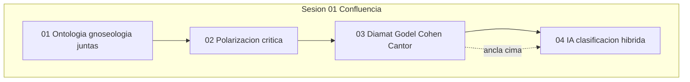

# INDICE — corpus cima-aleph (cota máxima)

## Visión del hilo

Corpus de **confluencia**: ontología y gnoseología no excluyentes; reunión hacia **objetividad sistémica**. Fuente: [`raw/log-agent-1.md`](raw/log-agent-1.md). Plan local: [`raw/log-agent2.md`](raw/log-agent2.md). Multitask: [`aleph-context/PLAN-multitask-sima-cima.md`](../aleph-context/PLAN-multitask-sima-cima.md).

El hilo abre con la aspiración de ser ontologista y gnoseologista a la vez; critica la polarización; recorre el diamat (marxismo-leninismo, historiografía soviética Mareev/Iliénkov); ancla en **Gödel (suelo ontológico) + Cohen (motor gnoseológico) + Cantor (horizonte Aleph)**; cierra clasificando paradigmas de IA (Dartmouth → hoy) y reflexionando si el mapa (IA) subsume el territorio (mente humana).

**Cota:** máxima (cima) — opuesta a [`sima-aleph/`](../sima-aleph/) (ruptura/discrepancia).

## Tabla de escenas

| ID | Escena | Resumen | Tags |
|----|--------|---------|------|
| [s01-01](sesion-01-ontologia-gnoseologia-confluencia/01-ontologia-gnoseologia-juntos/) | [01-ontologia-gnoseologia-juntos](sesion-01-ontologia-gnoseologia-confluencia/01-ontologia-gnoseologia-juntos/) | Ontología + gnoseología juntas (referentes y hoja de ruta) | `cima`, `confluencia`, `ontologia`, `gnoseologia`, `objetividad-sistemica` |
| [s01-02](sesion-01-ontologia-gnoseologia-confluencia/02-polarizacion-ontologia-gnoseologia/) | [02-polarizacion-ontologia-gnoseologia](sesion-01-ontologia-gnoseologia-confluencia/02-polarizacion-ontologia-gnoseologia/) | Polarización ontología vs gnoseología (¿es normal ignorar uno?) | `cima`, `confluencia`, `polarizacion`, `reduccionismo`, `objetividad-sistemica` |
| [s01-03](sesion-01-ontologia-gnoseologia-confluencia/03-godel-cohen-cantor-diamat/) | [03-godel-cohen-cantor-diamat](sesion-01-ontologia-gnoseologia-confluencia/03-godel-cohen-cantor-diamat/) ⚓ | Diamat + Gödel/Cohen/Cantor — escena ancla cima | `cima`, `ancla`, `diamat`, `Godel`, `Cohen` |
| [s01-04](sesion-01-ontologia-gnoseologia-confluencia/04-clasificacion-ia-ont-gnose/) | [04-clasificacion-ia-ont-gnose](sesion-01-ontologia-gnoseologia-confluencia/04-clasificacion-ia-ont-gnose/) | IA 1956–hoy: clasificación ontológica / gnoseológica / híbrida | `cima`, `IA`, `cognicion`, `hibrido`, `Dartmouth` |

## Mapa conceptual



## Anomalías documentadas

1. **s01-01**: prompt duplicado (líneas 1 y 3; línea 2 repetición corta).
2. **s01-03**: escena compuesta de 4 turnos (ML, diamat, Mareev, Gödel/Cohen); USER 1/2 en línea 277; footer AI línea 392.
3. **s01-04**: 3 turnos (clasificación IA, auto-aplicación híbrida, tabla mapa/territorio); think español sin `Analyze` en turno 2.
4. **Footers AI**: eliminados del cuerpo `output.md`; anotados en frontmatter.

## Guía de consulta para agentes

| Pregunta | Archivo recomendado |
|----------|---------------------|
| ¿Confluencia ontología+gnoseología? | `sesion-01-.../01-ontologia-gnoseologia-juntos/output.md` |
| ¿Crítica a la polarización? | `sesion-01-.../02-polarizacion-ontologia-gnoseologia/` |
| ¿Ancla Gödel/Cohen/Cantor + diamat? | `sesion-01-.../03-godel-cohen-cantor-diamat/output.md` |
| ¿Mapa IA ontológico/gnoseológico/híbrido? | `sesion-01-.../04-clasificacion-ia-ont-gnose/output.md` |
| ¿IA mapa vs territorio (isomorfismo)? | `sesion-01-.../04-clasificacion-ia-ont-gnose/output.md` (turno 3) |

## Estructura

```
cima-aleph/
├── raw/log-agent-1.md
├── raw/log-agent2.md          # plan local
├── segment_cima_log.py
├── manifest.json
├── INDICE.md
└── sesion-01-ontologia-gnoseologia-confluencia/
```

Regenerar: `python3 segment_cima_log.py`

## Detalle por escena

### [01-ontologia-gnoseologia-juntos](sesion-01-ontologia-gnoseologia-confluencia/01-ontologia-gnoseologia-juntos/)
**Tema:** Ontología + gnoseología juntas (referentes y hoja de ruta)
**Cota:** `cima` · **Rol:** confluencia, reunion, objetividad-sistemica
**Anomalías:** prompt_duplicado_lineas_1_y_3
- [prompt](sesion-01-ontologia-gnoseologia-confluencia/01-ontologia-gnoseologia-juntos/prompt.md) · [think](sesion-01-ontologia-gnoseologia-confluencia/01-ontologia-gnoseologia-juntos/think.md) · [trace](sesion-01-ontologia-gnoseologia-confluencia/01-ontologia-gnoseologia-juntos/trace.md) · [output](sesion-01-ontologia-gnoseologia-confluencia/01-ontologia-gnoseologia-juntos/output.md)

### [02-polarizacion-ontologia-gnoseologia](sesion-01-ontologia-gnoseologia-confluencia/02-polarizacion-ontologia-gnoseologia/)
**Tema:** Polarización ontología vs gnoseología (¿es normal ignorar uno?)
**Cota:** `cima` · **Rol:** confluencia, reunion, objetividad-sistemica
- [prompt](sesion-01-ontologia-gnoseologia-confluencia/02-polarizacion-ontologia-gnoseologia/prompt.md) · [think](sesion-01-ontologia-gnoseologia-confluencia/02-polarizacion-ontologia-gnoseologia/think.md) · [trace](sesion-01-ontologia-gnoseologia-confluencia/02-polarizacion-ontologia-gnoseologia/trace.md) · [output](sesion-01-ontologia-gnoseologia-confluencia/02-polarizacion-ontologia-gnoseologia/output.md)

### [03-godel-cohen-cantor-diamat](sesion-01-ontologia-gnoseologia-confluencia/03-godel-cohen-cantor-diamat/)
**Tema:** Diamat + Gödel/Cohen/Cantor — escena ancla cima
**Cota:** `cima` · **Rol:** confluencia, reunion, objetividad-sistemica
**Anomalías:** escena_compuesta_4_turnos, user1_user2_fusionados_linea_277, footer_ai_linea_392_en_turno_mareev
- [prompt](sesion-01-ontologia-gnoseologia-confluencia/03-godel-cohen-cantor-diamat/prompt.md) · [think](sesion-01-ontologia-gnoseologia-confluencia/03-godel-cohen-cantor-diamat/think.md) · [trace](sesion-01-ontologia-gnoseologia-confluencia/03-godel-cohen-cantor-diamat/trace.md) · [output](sesion-01-ontologia-gnoseologia-confluencia/03-godel-cohen-cantor-diamat/output.md)

### [04-clasificacion-ia-ont-gnose](sesion-01-ontologia-gnoseologia-confluencia/04-clasificacion-ia-ont-gnose/)
**Tema:** IA 1956–hoy: clasificación ontológica / gnoseológica / híbrida
**Cota:** `cima` · **Rol:** confluencia, reunion, objetividad-sistemica
**Anomalías:** escena_compuesta_3_turnos, turno_2_think_espanol_sin_bloques_Analyze, meta_reflexion_ia_mapa_territorio_en_turnos_2_3
- [prompt](sesion-01-ontologia-gnoseologia-confluencia/04-clasificacion-ia-ont-gnose/prompt.md) · [think](sesion-01-ontologia-gnoseologia-confluencia/04-clasificacion-ia-ont-gnose/think.md) · [trace](sesion-01-ontologia-gnoseologia-confluencia/04-clasificacion-ia-ont-gnose/trace.md) · [output](sesion-01-ontologia-gnoseologia-confluencia/04-clasificacion-ia-ont-gnose/output.md)
