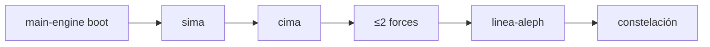

# INDICE — registry maestro engines (Cohen Force)

Registry agregado de **8 engines** indexados: `main-engine` (boot) + `engine-model-A` … `engine-model-F` (forces).

Plan: [`PLAN-multitask-engines.md`](PLAN-multitask-engines.md) · Manifest: [`manifest.json`](manifest.json) · Esquema: [`engine.schema.json`](engine.schema.json)

## Rol en Modo Aleph

Los engines son **condiciones de forcing Cohen** — inyectan orígenes de mirada y lore sin ser cotas (sima/cima) ni polos del tablero.

- **main-engine**: boot estético dummy, siempre ON; no cuenta contra límite de forces
- **forces**: máx. **2 activos** por sesión; 1 escena ancla por force activo



## Tabla de engines (indexados)

| ID | INDICE | Rol | Cohen type | Escena ancla | Escenas | Líneas | Coverage | Pairs with | Status |
|----|--------|-----|------------|--------------|---------|--------|----------|------------|--------|
| [main-engine](main-engine/) | [INDICE](main-engine/INDICE.md) | boot | aesthetic_boot | `sesion-01-boot-estetico-operativo/01-aspirate-a-esteta` | 3 | 274 | 274/274 ✓ | sima, cima | **indexed** |
| [engine-model-A](engine-model-A/) | [INDICE](engine-model-A/INDICE.md) | force | dialectic_poles_ab | `sesion-02-internacionales-cafe-muertos/09-internacionales-polo-ab` † | 11 | 973 | 973/973 ✓ | E, linea | **indexed** |
| [engine-model-B](engine-model-B/) | [INDICE](engine-model-B/INDICE.md) | force | disobedience | `sesion-01-omega-manhattan/04-omega-manhattan` | 6 | 462 | 462/462 ✓ | E, sima, linea | **indexed** |
| [engine-model-C](engine-model-C/) | [INDICE](engine-model-C/INDICE.md) | force | political_economy | `sesion-01-piramide-riqueza-espana/01-piramide-riqueza-espana` | 8 | 1032 | 1032/1032 ✓ | linea, E | **indexed** |
| [engine-model-D](engine-model-D/) | [INDICE](engine-model-D/INDICE.md) | force | credos | `sesion-01-conversion-apostasia/01-conversion-apostasia-tablas` | 4 | 179 | 179/179 ✓ | F, cima | **indexed** |
| [engine-model-E](engine-model-E/) | [INDICE](engine-model-E/INDICE.md) | force | impotent_document | `sesion-01-documento-impotente-epica-poder/02-carta-derechos-nrx` | 6 | 429 | 429/429 ✓ | A, C | **indexed** |
| [engine-model-F](engine-model-F/) | [INDICE](engine-model-F/INDICE.md) | force | poetic_existential | `sesion-01-pizarnik-jaula-pajaro/01-pizarnik-jaula-pajaro` | 3 | 163 | 163/163 ✓ | D, sima, cima | **indexed** |

**Totales:** 41 escenas · 3512 líneas raw · 8/8 indexed · segment scripts OK

† `engine-model-A/engine.json` declara `sesion-02-internacionales-dialectica-ab/09-internacionales-polo-ab`; manifest y segment usan `sesion-02-internacionales-cafe-muertos/09-internacionales-polo-ab`.

## Estructura registry

```
engines/
├── PLAN-multitask-engines.md
├── INDICE.md                 ← este archivo
├── manifest.json             ← registry agregado (8 entries)
├── engine.schema.json
├── segment_engine_template.py
├── main-engine/              manifest.json · INDICE.md · engine.json · segment_main_engine_log.py
├── engine-model-A/           manifest.json · INDICE.md · engine.json · segment_engine_model_a_log.py
├── engine-model-B/           …
├── engine-model-C/           …
├── engine-model-D/           …
├── engine-model-E/           …
└── engine-model-F/           …
```

## Pares sugeridos (pairs_with en engine.json)

| Force | Pairs with |
|-------|------------|
| main-engine | [sima-aleph](../sima-aleph/INDICE.md), [cima-aleph](../cima-aleph/INDICE.md) |
| A | engine-model-E, [linea-aleph](../linea-aleph/INDICE.md) |
| B | engine-model-E, [sima-aleph](../sima-aleph/INDICE.md), [linea-aleph](../linea-aleph/INDICE.md) |
| C | [linea-aleph](../linea-aleph/INDICE.md), engine-model-E |
| D | engine-model-F, [cima-aleph](../cima-aleph/INDICE.md) |
| E | engine-model-A, engine-model-C |
| F | engine-model-D, [sima-aleph](../sima-aleph/INDICE.md), [cima-aleph](../cima-aleph/INDICE.md) |

## Corpus relacionado (cross_corpus)

| Corpus | Path | Engines emparejados |
|--------|------|-------------------|
| [sima-aleph](../sima-aleph/INDICE.md) | `../sima-aleph/` | main-engine, B, F |
| [cima-aleph](../cima-aleph/INDICE.md) | `../cima-aleph/` | main-engine, D, F |
| [linea-aleph](../linea-aleph/INDICE.md) | `../linea-aleph/` | A, B, C |

## Guía de consulta

| Pregunta | Engine | Escena ancla |
|----------|--------|--------------|
| ¿Boot estético / asentamiento? | main-engine | `01-aspirate-a-esteta` |
| ¿Lenin / Internacionales polo A-B? | A | `09-internacionales-polo-ab` |
| ¿Satyagraha / Omega Manhattan? | B | `04-omega-manhattan` |
| ¿Pirámide riqueza España? | C | `01-piramide-riqueza-espana` |
| ¿Conversión vs apostasía? | D | `01-conversion-apostasia-tablas` |
| ¿Carta derechos / NRx? | E | `02-carta-derechos-nrx` |
| ¿Pizarnik jaula-pájaro? | F | `01-pizarnik-jaula-pajaro` |

## Verificación

```bash
cd engines
python3 main-engine/segment_main_engine_log.py
python3 engine-model-A/segment_engine_model_a_log.py
python3 engine-model-B/segment_engine_model_b_log.py
python3 engine-model-C/segment_engine_model_c_log.py
python3 engine-model-D/segment_engine_model_d_log.py
python3 engine-model-E/segment_engine_model_e_log.py
python3 engine-model-F/segment_engine_model_f_log.py
```

Todos devuelven `"ok": true` y exit 0 (verificado 2026-06-19).
