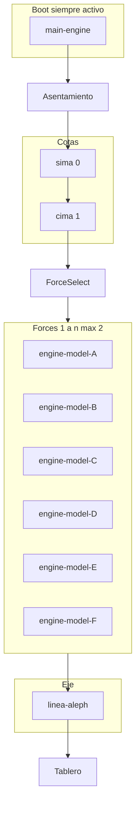

# Plan multitask — Engines como Force de Cohen

Referencia condensada del plan maestro. Fuente completa: `.cursor/plans/engines_cohen_force_ab112620.plan.md` (no editar desde tracks de engine).

## Metáfora

- **Gödel** = suelo (ontología) · **Cohen** = motor forcing · **Cantor** = horizonte Aleph
- **sima / cima** = cotas del tablero (0 ruptura / 1 confluencia)
- **engines** = condiciones de forcing — orígenes de mirada y lore, no polos ni cotas
- **main-engine** = boot estético dummy, siempre ON; no cuenta contra límite de forces

## Arquitectura



## Inventario (8 legacy + 2 transcardinales XZ/ZX)

| ID | Raw | Líneas | Rol Cohen | Ancla propuesta | Escenas ~ |
|----|-----|--------|-----------|-----------------|-----------|
| [main-engine](main-engine/) | agent-logs-1/2.md | 60+214 | motor estético dummy | `01-aspirate-a-esteta` | 2–3 |
| [engine-model-A](engine-model-A/) | logs-agent-1, log-agents-2 | 710+263 | dialéctico Lenin/Marx | `internacionales-polo-ab` | 10–12 |
| [engine-model-B](engine-model-B/) | logs-agent-1/2 | 318+144 | desobediencia Duran/Omega | `omega-manhattan` | 5–6 |
| [engine-model-C](engine-model-C/) | logs-agent-1/2 | 959+73 | economía política ES | `piramide-riqueza-espana` | 6–8 |
| [engine-model-D](engine-model-D/) | logs-agent-1 | 52 | credos conversión | `conversion-apostasia-tablas` | 1–2 |
| [engine-model-E](engine-model-E/) | logs-agent-1/2 | 160+269 | documento impotente NRx | `carta-derechos-nrx` | 5–6 |
| [engine-model-F](engine-model-F/) | logs-agent-1 | 163 | poético Pizarnik | `pizarnik-jaula-pajaro` | 2–3 |

## Estructura por engine

```
engines/{engine-id}/
├── raw/
├── segment_{id}_log.py    # copia de segment_engine_template.py
├── manifest.json
├── INDICE.md
├── engine.json            # ficha Force — ver engine.schema.json
└── sesion-XX-.../
    └── NN-slug/
        ├── prompt.md
        ├── think.md
        ├── output.md
        └── trace.md
```

## Heurísticas de segmentación

| Formato | Think | Trace |
|---------|-------|-------|
| Cursor export (`**User**`) | `Analyze`, `We need to` | Found/Read pages |
| Expert Mode (sima) | `Interpretation:`, `We need to` | Search unavailable |
| Diálogo plano (main-engine) | bloques tras prompt usuario | footers AI |

Plantilla: [`segment_engine_template.py`](segment_engine_template.py) — parametrizar `ENGINE_ID`, `LOG_FORMAT`, `SESSION`, `SCENES`.

## Oleadas multitask

| Oleada | Tracks | Entrega |
|--------|--------|---------|
| 0 | E0 | registry + template + schema |
| 1 | E-main, E-A | segmentador, manifest, INDICE, engine.json |
| 2 | E-B, E-C | idem |
| 3 | E-D, E-E, E-F | idem |
| 4 | F-skill | modo-aleph, engines-active.json, prompt-test 03 |

## Presupuesto sesión (objetivo)

- main-engine ancla ~0.5k · sima+cima ~3–6k · ≤2 forces × 1 escena ~3–6k
- **Máx. 2 force engines activos** por sesión (además de main-engine)

## Esquema engine.json

Ver [`engine.schema.json`](engine.schema.json). Campos clave:

- `id`, `role` (`boot` | `force`), `cohen_type`, `viewpoint_origin`, `lore_hook`
- `anchor_scene`, `activation_triggers`, `pairs_with`
- `status`: `pending` → `indexed` tras indexado

## Criterios de éxito

- [x] 9 engines con manifest + INDICE + cobertura verificada (7 legacy + 2 transcardinales XZ/ZX)
- [x] `engines/manifest.json` agrega los 9 con anclas y triggers
- [x] Skill documenta boot + forces sin añadir polos ([`agents/skills/modo-aleph/engines.md`](../agents/skills/modo-aleph/engines.md))
- [x] Runbook transcardinal ([`RUNBOOK-indexar.md`](RUNBOOK-indexar.md))
- [x] `engines-active.json` declara main + ≤2 forces (scaffold A+E calibración 03, 2026-06-20)
- [ ] prompt-test 03 calibra A+E sobre NRx/diamat (review scaffold 2026-06-20; turno live pendiente)
- [ ] prompt-tests 04 (XZ) y 05 (ZX) en sesiones independientes (scaffold 2026-06-20)

## Relación con corpus

| Corpus | Relación |
|--------|----------|
| sima-cima | Cotas; engines no sustituyen |
| linea-aleph | Eje; A enlaza demarcación |
| logs-aleph | Tablero; engines = lores de contraste |
