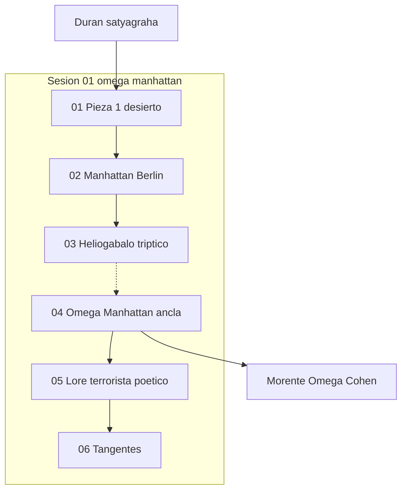

# INDICE — engine-model-B (Cohen Force desobediencia)

## Rol en Modo Aleph

**Force B:** satyagraha económica — Duran, Lucio Urtubia, Omega Morente/Cohen
como forcing de desobediencia civil frente al sistema financiero.

Escena ancla: [`04-omega-manhattan`](sesion-01-omega-manhattan/04-omega-manhattan/).

Registry: [`../manifest.json`](../manifest.json) · Ficha: [`engine.json`](engine.json).
Contraste sugerido: [`engine-model-E`](../engine-model-E/) (NRx), [`sima-aleph`](../../sima-aleph/INDICE.md).

## Visión del hilo

El corpus parte de un videoclip mental satyagraha (Duran, Gandhi, Lucio, Lorca-Cohen-Morente),
profundiza el eje Manhattan/Berlín como desobediencia económica, reescribe la tríada con
Heliogábalo y dos mujeres históricas, y en el segundo log despliega el lore de *Omega*
(Morente, Cohen, Lagartija Nick, Lorca) hasta tangentes cypherpunk y Sputnik.

## Tabla de escenas

| ID | Escena | Rol | Resumen | Tags |
|----|--------|-----|---------|------|
| [b01-01](sesion-01-omega-manhattan/01-pieza-1-desierto-satyagraha/) | [01-pieza-1-desierto-satyagraha](sesion-01-omega-manhattan/01-pieza-1-desierto-satyagraha/) | `apertura` | Pieza 1 rediseñada — desierto, rueca y flor de azafrán | `force:B`, `cohen:disobedience`, `satyagraha`, `omega-manhattan` |
| [b01-02](sesion-01-omega-manhattan/02-manhattan-berlin-satyagraha/) | [02-manhattan-berlin-satyagraha](sesion-01-omega-manhattan/02-manhattan-berlin-satyagraha/) | `simbolismo` | Manhattan y Berlín — eje financiero y contracultura | `force:B`, `cohen:disobedience`, `satyagraha`, `omega-manhattan` |
| [b01-03](sesion-01-omega-manhattan/03-heliogabalo-triptico-mujeres/) | [03-heliogabalo-triptico-mujeres](sesion-01-omega-manhattan/03-heliogabalo-triptico-mujeres/) | `reescritura` | Heliogábalo-Gandhi — Catalina de Erauso y Baronesa Elsa | `force:B`, `cohen:disobedience`, `satyagraha`, `omega-manhattan` |
| [b01-04](sesion-01-omega-manhattan/04-omega-manhattan/) | [04-omega-manhattan](sesion-01-omega-manhattan/04-omega-manhattan/) ⚓ | `ancla` | Omega «primero Manhattan y después Berlín» — ancla Morente/Cohen | `force:B`, `cohen:disobedience`, `satyagraha`, `omega-manhattan` |
| [b01-05](sesion-01-omega-manhattan/05-omega-lore-terrorista-poetico/) | [05-omega-lore-terrorista-poetico](sesion-01-omega-manhattan/05-omega-lore-terrorista-poetico/) | `profundizacion` | Lore real Omega — canción terrorista, Lorca y documental | `force:B`, `cohen:disobedience`, `satyagraha`, `omega-manhattan` |
| [b01-06](sesion-01-omega-manhattan/06-tangentes-cypherpunk-sputnik/) | [06-tangentes-cypherpunk-sputnik](sesion-01-omega-manhattan/06-tangentes-cypherpunk-sputnik/) | `tangente` | Tangentes — cypherpunk vs cyberpunk y Sputnik 1 | `force:B`, `cohen:disobedience`, `satyagraha`, `omega-manhattan` |

## Mapa conceptual



## Fuentes

| Archivo | Líneas | Escenas |
|---------|--------|---------|
| [`raw/logs-agent-1.md`](raw/logs-agent-1.md) | 318 | 3 · OK |
| [`raw/logs-agent-2.md`](raw/logs-agent-2.md) | 144 | 3 · OK |

## Anomalías documentadas

- **b01-01** (01-pieza-1-desierto-satyagraha): prompt_embebido_en_think_linea_3
- **b01-02** (02-manhattan-berlin-satyagraha): expert_mode_search_unavailable
- **b01-03** (03-heliogabalo-triptico-mujeres): think_largo_144_lineas
- **b01-04** (04-omega-manhattan): titulo_como_prompt_linea_1
- **b01-05** (05-omega-lore-terrorista-poetico): enumeracion_descafeinada_rechazada
- **b01-06** (06-tangentes-cypherpunk-sputnik): dos_turnos_en_una_escena

## Guía de consulta

| Pregunta | Escena |
|----------|--------|
| ¿Rediseño Pieza 1 sin políticas explícitas? | `01-pieza-1-desierto-satyagraha/output.md` |
| ¿Por qué Manhattan y Berlín en Cohen/Duran? | `02-manhattan-berlin-satyagraha/output.md` |
| ¿Heliogábalo, Erauso, Elsa von Freytag-Loringhoven? | `03-heliogabalo-triptico-mujeres/output.md` |
| ¿«Primero Manhattan y después Berlín» en Omega? | `04-omega-manhattan/output.md` |
| ¿Lore terrorista poético / documental Omega? | `05-omega-lore-terrorista-poetico/output.md` |

## Cobertura

- Escenas: 6
- Verificación global: OK

Regenerar: `python3 segment_engine_model_b_log.py`

## Estructura

```
engine-model-B/
├── raw/logs-agent-1.md
├── raw/logs-agent-2.md
├── segment_engine_model_b_log.py
├── manifest.json
├── INDICE.md
├── engine.json
└── sesion-01-omega-manhattan/
```
