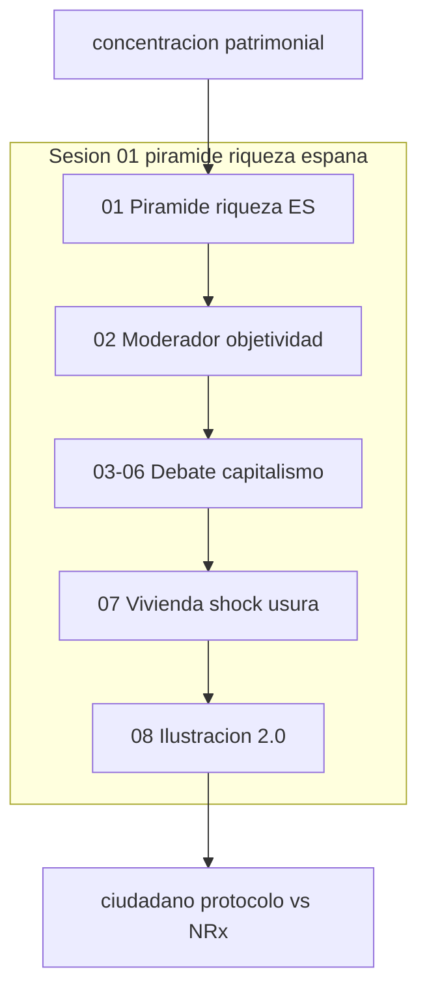

# INDICE — engine-model-C (Cohen Force economía política ES)

## Rol en Modo Aleph

**Force C:** economía política española — pirámide patrimonial, debate Borrego/decrecimiento,
ciudadano-protocolo frente a NRx. Ancla: concentración de riqueza y percentiles.

Escena ancla: [`01-piramide-riqueza-espana`](sesion-01-piramide-riqueza-espana/01-piramide-riqueza-espana/).

Registry: [`manifest.json`](manifest.json) · Ficha: [`engine.json`](engine.json).
Contraste sugerido: [`engine-model-E`](../engine-model-E/) (NRx), [`linea-aleph`](../../linea-aleph/INDICE.md).

## Visión del hilo

El corpus [`raw/logs-agent-1.md`](raw/logs-agent-1.md) (959 líneas) abre con la pirámide
de riqueza y renta en España (2019-2023), modera un debate decrecentista entre Borrego y el
respondiente, arma referencias críticas (greenwashing, fiscalidad, vivienda) y cierra con el
shock crediticio de hipotecas a 10 años y la parábola templo/usura.
[`raw/logs-agent-2.md`](raw/logs-agent-2.md) (73 líneas) enlaza Ilustración 2.0:
ciudadano como avatar jurídico frente a la cancelación NRx del filósofo.

## Tabla de escenas

| ID | Escena | Rol | Resumen | Tags |
|----|--------|-----|---------|------|
| [c01-01](sesion-01-piramide-riqueza-espana/01-piramide-riqueza-espana/) | [01-piramide-riqueza-espana](sesion-01-piramide-riqueza-espana/01-piramide-riqueza-espana/) ⚓ | `ancla` | Pirámide patrimonial España — percentiles, Gini y renta 2019-2023 | `force:C`, `cohen:political_economy`, `Espana`, `economia_politica` |
| [c01-02](sesion-01-piramide-riqueza-espana/02-moderador-objetividad-borrego/) | [02-moderador-objetividad-borrego](sesion-01-piramide-riqueza-espana/02-moderador-objetividad-borrego/) | `moderacion` | Moderador objetividad sistémica — Borrego vs respondiente (decrecimiento) | `force:C`, `cohen:political_economy`, `Espana`, `economia_politica` |
| [c01-03](sesion-01-piramide-riqueza-espana/03-ayuda-respondiente-referencias/) | [03-ayuda-respondiente-referencias](sesion-01-piramide-riqueza-espana/03-ayuda-respondiente-referencias/) | `asistencia` | Ayuda al respondiente — URSS, Ponzi, fiscalidad, greenwashing | `force:C`, `cohen:political_economy`, `Espana`, `economia_politica` |
| [c01-04](sesion-01-piramide-riqueza-espana/04-greenwashing-ipcc-montreal/) | [04-greenwashing-ipcc-montreal](sesion-01-piramide-riqueza-espana/04-greenwashing-ipcc-montreal/) | `asistencia` | Greenwashing — Volkswagen, IPCC y Protocolo de Montreal | `force:C`, `cohen:political_economy`, `Espana`, `economia_politica` |
| [c01-05](sesion-01-piramide-riqueza-espana/05-borrego-replica-vivienda-10-anos/) | [05-borrego-replica-vivienda-10-anos](sesion-01-piramide-riqueza-espana/05-borrego-replica-vivienda-10-anos/) | `debate` | Réplica Borrego — competitividad, fiscalidad y hipotecas a 10 años | `force:C`, `cohen:political_economy`, `Espana`, `economia_politica` |
| [c01-06](sesion-01-piramide-riqueza-espana/06-conclusion-capital-mea-llueve/) | [06-conclusion-capital-mea-llueve](sesion-01-piramide-riqueza-espana/06-conclusion-capital-mea-llueve/) | `sintesis` | Conclusión «el capital nos mea y dice que llueve» — cuatro frases | `force:C`, `cohen:political_economy`, `Espana`, `economia_politica` |
| [c01-07](sesion-01-piramide-riqueza-espana/07-vivienda-shock-antagonistas-jesus/) | [07-vivienda-shock-antagonistas-jesus](sesion-01-piramide-riqueza-espana/07-vivienda-shock-antagonistas-jesus/) | `analisis` | Shock crediticio vivienda — mapa antagonistas y parábola del templo | `force:C`, `cohen:political_economy`, `Espana`, `economia_politica` |
| [c01-08](sesion-01-piramide-riqueza-espana/08-ilustracion-2-ciudadano-protocolo/) | [08-ilustracion-2-ciudadano-protocolo](sesion-01-piramide-riqueza-espana/08-ilustracion-2-ciudadano-protocolo/) | `marco` | Ilustración 2.0 — ciudadano-protocolo vs NRx (Robespierre / Ethereum arquetipo) | `force:C`, `cohen:political_economy`, `Espana`, `economia_politica` |

## Mapa conceptual

## Guía de consulta

| Pregunta | Escena |
|----------|--------|
| ¿Pirámide riqueza España / percentiles? | `01-piramide-riqueza-espana/output.md` |
| ¿Tabla objetividad Borrego/decrecimiento? | `02-moderador-objetividad-borrego/output.md` |
| ¿Referencias respondiente (URSS, Ponzi)? | `03-ayuda-respondiente-referencias/output.md` |
| ¿Greenwashing vs ciencia climática? | `04-greenwashing-ipcc-montreal/output.md` |
| ¿Hipotecas 10 años / corralito? | `05-borrego-replica-vivienda-10-anos/output.md` |
| ¿«El capital nos mea y dice que llueve»? | `06-conclusion-capital-mea-llueve/output.md` |
| ¿Mapa antagonistas crédito vivienda? | `07-vivienda-shock-antagonistas-jesus/output.md` |
| ¿Ilustración 2.0 ciudadano-protocolo? | `08-ilustracion-2-ciudadano-protocolo/output.md` |

## Cobertura

- `logs-agent-1.md`: 959 líneas
- `logs-agent-2.md`: 73 líneas
- Escenas: 8
- Verificación: OK

Regenerar: `python3 segment_engine_model_c_log.py`
