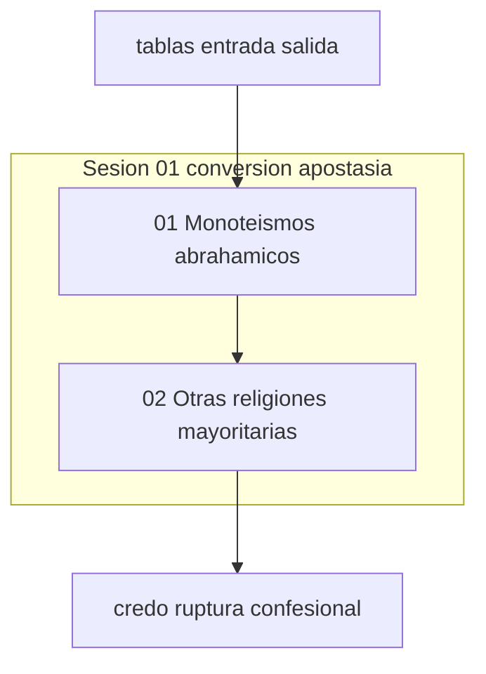

# INDICE — engine-model-D (Cohen Force credos)

## Rol en Modo Aleph

**Force D:** credos — tablas comparadas de conversión y apostasía en religiones mayoritarias.

Escena ancla: [`01-conversion-apostasia-tablas`](sesion-01-conversion-apostasia/01-conversion-apostasia-tablas/).

Registry: [`../manifest.json`](../manifest.json) · Ficha: [`engine.json`](engine.json).
Contraste sugerido: [`engine-model-F`](../engine-model-F/) (poético), [`cima-aleph`](../../cima-aleph/INDICE.md).

## Visión del hilo

El corpus [`raw/logs-agent-1.md`](raw/logs-agent-1.md) (52 líneas) parte de una solicitud
de tablas entrada/salida por credo: primero los tres monoteísmos abrahámicos, luego
hinduismo, budismo y sijismo. Formato Expert Mode con trace «Search unavailable».

## Tabla de escenas

| ID | Escena | Rol | Resumen | Tags |
|----|--------|-----|---------|------|
| [d01-01](sesion-01-conversion-apostasia/01-conversion-apostasia-tablas/) | [01-conversion-apostasia-tablas](sesion-01-conversion-apostasia/01-conversion-apostasia-tablas/) | `ancla` | Tabla 1 — monoteísmos abrahámicos (entrada / salida) | `force:D`, `credos`, `conversion`, `apostasia` |
| [d01-02](sesion-01-conversion-apostasia/02-otras-religiones-mayoritarias/) | [02-otras-religiones-mayoritarias](sesion-01-conversion-apostasia/02-otras-religiones-mayoritarias/) | `continuacion` | Tabla 2 — hinduismo, budismo, sijismo | `force:D`, `credos`, `conversion`, `apostasia` |

## Mapa conceptual



## Anomalías documentadas

- **d01-01** (01-conversion-apostasia-tablas): titulo_contexto_linea_1_mezclado_con_prompt
- **d01-02** (02-otras-religiones-mayoritarias): sin_nuevo_prompt_usuario

## Guía de consulta

| Pregunta | Escena |
|----------|--------|
| ¿Conversión/apostasía en judaísmo, cristianismo, islam? | `01-conversion-apostasia-tablas/output.md` |
| ¿Hinduismo, budismo, sijismo — entrada y salida? | `02-otras-religiones-mayoritarias/output.md` |

## Cobertura

- Líneas fuente: 52
- Líneas cubiertas: 52
- Verificación: OK

## Estructura

```
engine-model-D/
├── raw/logs-agent-1.md
├── segment_engine_model_d_log.py
├── manifest.json
├── INDICE.md
├── engine.json
└── sesion-01-conversion-apostasia/
```
