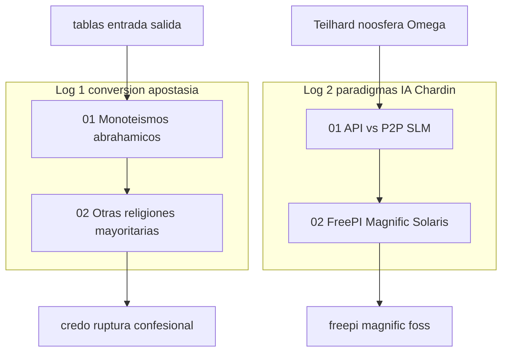

# INDICE — engine-model-D (Cohen Force credos)

## Rol en Modo Aleph

**Force D:** credos — tablas comparadas de conversión/apostasía y paradigmas tecnológicos.

Escena ancla: [`01-conversion-apostasia-tablas`](sesion-01-conversion-apostasia/01-conversion-apostasia-tablas/).
Sesión 02: paradigmas IA (API vs P2P/SLM) con lente Teilhard de Chardin.

Fuentes:
- [`raw/logs-agent-1.md`](raw/logs-agent-1.md) (52 líneas) — conversión/apostasía en religiones mayoritarias
- [`raw/logs-agent-2.md`](raw/logs-agent-2.md) (127 líneas) — paradigmas IA, FreePI, Magnific

Registry: [`../manifest.json`](../manifest.json) · Ficha: [`engine.json`](engine.json).
Contraste sugerido: [`engine-model-F`](../engine-model-F/) (poético), [`cima-aleph`](../../cima-aleph/INDICE.md).

## Visión del hilo

Log-1 parte de tablas entrada/salida por credo: monoteísmos abrahámicos, luego hinduismo,
budismo y sijismo. Log-2 traslada el contraste 2001/Solaris al ecosistema IA (API centralizada
vs P2P/Petals/SLM) con Teilhard de Chardin, y añade FreePI y Magnific como ejemplos FOSS españoles.

## Tabla de escenas

| ID | Escena | Sesión | Fuente | Líneas | Rol | Resumen | Tags |
|----|--------|--------|--------|--------|-----|---------|------|
| [d01-01](sesion-01-conversion-apostasia/01-conversion-apostasia-tablas/) | [01-conversion-apostasia-tablas](sesion-01-conversion-apostasia/01-conversion-apostasia-tablas/) | `sesion-01-conversion-apostasia` | `logs-agent-1.md` | 1–31 | `ancla` | Tabla 1 — monoteísmos abrahámicos (entrada / salida) | `force:D`, `credos`, `conversion`, `apostasia` |
| [d01-02](sesion-01-conversion-apostasia/02-otras-religiones-mayoritarias/) | [02-otras-religiones-mayoritarias](sesion-01-conversion-apostasia/02-otras-religiones-mayoritarias/) | `sesion-01-conversion-apostasia` | `logs-agent-1.md` | 32–52 | `continuacion` | Tabla 2 — hinduismo, budismo, sijismo | `force:D`, `credos`, `conversion`, `apostasia` |
| [d02-01](sesion-02-paradigmas-ia-chardin/01-paradigma-api-p2p-chardin/) | [01-paradigma-api-p2p-chardin](sesion-02-paradigmas-ia-chardin/01-paradigma-api-p2p-chardin/) | `sesion-02-paradigmas-ia-chardin` | `logs-agent-2.md` | 1–54 | `ancla_sesion` | Tabla comparativa API centralizada vs P2P/SLM — lente Teilhard de Chardin | `force:D`, `credos`, `paradigmas`, `chardin` |
| [d02-02](sesion-02-paradigmas-ia-chardin/02-freepi-magnific-solaris/) | [02-freepi-magnific-solaris](sesion-02-paradigmas-ia-chardin/02-freepi-magnific-solaris/) | `sesion-02-paradigmas-ia-chardin` | `logs-agent-2.md` | 55–127 | `continuacion` | FreePI y Magnific — proyectos FOSS españoles en clave Solaris/P2P | `force:D`, `credos`, `paradigmas`, `chardin` |

## Mapa conceptual



## Anomalías documentadas

- **d01-01** (01-conversion-apostasia-tablas): titulo_contexto_linea_1_mezclado_con_prompt
- **d01-02** (02-otras-religiones-mayoritarias): sin_nuevo_prompt_usuario
- **d02-01** (01-paradigma-api-p2p-chardin): titulo_linea_1_como_contexto, prompt_usuario_no_explicito
- **d02-02** (02-freepi-magnific-solaris): prompt_embebido_en_think_linea_61, proyectos_inferidos_sin_repo, footer_ai_linea_127

## Guía de consulta

| Pregunta | Escena |
|----------|--------|
| ¿Conversión/apostasía en judaísmo, cristianismo, islam? | `sesion-01-conversion-apostasia/01-conversion-apostasia-tablas/output.md` |
| ¿Hinduismo, budismo, sijismo — entrada y salida? | `sesion-01-conversion-apostasia/02-otras-religiones-mayoritarias/output.md` |
| ¿API centralizada vs P2P/SLM con Chardin? | `sesion-02-paradigmas-ia-chardin/01-paradigma-api-p2p-chardin/output.md` |
| ¿FreePI y Magnific en clave Solaris? | `sesion-02-paradigmas-ia-chardin/02-freepi-magnific-solaris/output.md` |

## Cobertura

- `raw/logs-agent-1.md`: 52/52 líneas · OK
- `raw/logs-agent-2.md`: 127/127 líneas · OK
- Total: 179 líneas · OK

## Estructura

```
engine-model-D/
├── raw/logs-agent-1.md
├── raw/logs-agent-2.md
├── segment_engine_model_d_log.py
├── manifest.json
├── INDICE.md
├── engine.json
├── sesion-01-conversion-apostasia/
└── sesion-02-paradigmas-ia-chardin/
```

Regenerar: `python3 segment_engine_model_d_log.py`
