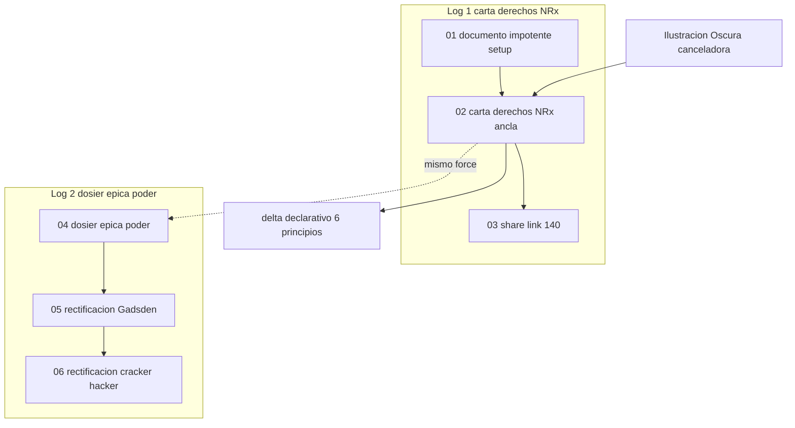

# INDICE — engine-model-E (force Cohen)

## Rol en el tablero Aleph

**Force Cohen:** documento impotente — carta de derechos / anti-NRx + dosier épica del poder.
Contrasta declaraciones sin coerción (1789→delta) con sombras del poder (cracker, vencedores, Unamuno).

Escena ancla primaria: [`02-carta-derechos-nrx`](sesion-01-documento-impotente-epica-poder/02-carta-derechos-nrx/).
Ancla alternativa: [`04-dosier-epica-poder`](sesion-01-documento-impotente-epica-poder/04-dosier-epica-poder/).

Fuentes:
- [`raw/logs-agent-1.md`](raw/logs-agent-1.md) (160 líneas) — carta derechos, NRx, delta declarativo
- [`raw/logs-agent-2.md`](raw/logs-agent-2.md) (269 líneas) — dosier cracker/hacker + rectificaciones

Registry: [`../manifest.json`](../manifest.json) · Ficha: [`engine.json`](engine.json).
Contraste sugerido: [`engine-model-A`](../engine-model-A/) (diamat), [`engine-model-C`](../engine-model-C/) (economía política).

## Visión del hilo

Log-1 parte del marco «documento impotente» (principios sin mecanismo coercitivo), toma la
Declaración de 1789 frente a la Ilustración Oscura (Land, Thiel, Yarvin) como proyecto cancelador,
y escribe un delta homólogo (autonomía cognitiva, soberanía digital, resistencia algorítmica).
Log-2 despliega un dosier de épica del poder tras un ciberataque (cracker vs hacker, Unamuno,
Gadsden) y acumula dos notas de rectificación que corrigen traducción creativa y binario ético.

## Tabla de escenas

| ID | Escena | Fuente | Líneas | Resumen | Tags |
|----|--------|--------|--------|---------|------|
| [e01-01](sesion-01-documento-impotente-epica-poder/01-marco-documento-impotente/) | [01-marco-documento-impotente](sesion-01-documento-impotente-epica-poder/01-marco-documento-impotente/) | `logs-agent-1.md` | 1–27 | Marco «documento impotente» y principios sin coerción | `engine`, `engine_model_e`, `force`, `impotent_document` |
| [e01-02](sesion-01-documento-impotente-epica-poder/02-carta-derechos-nrx/) | [02-carta-derechos-nrx](sesion-01-documento-impotente-epica-poder/02-carta-derechos-nrx/) ⚓ | `logs-agent-1.md` | 28–146 | Carta de derechos humanos vs Ilustración Oscura (NRx) — delta homólogo | `engine`, `engine_model_e`, `force`, `impotent_document` |
| [e01-03](sesion-01-documento-impotente-epica-poder/03-share-delta-anuncio/) | [03-share-delta-anuncio](sesion-01-documento-impotente-epica-poder/03-share-delta-anuncio/) | `logs-agent-1.md` | 147–160 | Anuncio breve para compartir el delta (≤140 caracteres) | `engine`, `engine_model_e`, `force`, `impotent_document` |
| [e02-01](sesion-01-documento-impotente-epica-poder/04-dosier-epica-poder/) | [04-dosier-epica-poder](sesion-01-documento-impotente-epica-poder/04-dosier-epica-poder/) ⚓₂ | `logs-agent-2.md` | 1–90 | Dosier cultural: cracker vs hacker, épica del poder y sombras | `engine`, `engine_model_e`, `force`, `impotent_document` |
| [e02-02](sesion-01-documento-impotente-epica-poder/05-rectificacion-no-me-pises/) | [05-rectificacion-no-me-pises](sesion-01-documento-impotente-epica-poder/05-rectificacion-no-me-pises/) | `logs-agent-2.md` | 91–160 | Rectificación: don't tread on me → «no me pises» (no «trampas») | `engine`, `engine_model_e`, `force`, `impotent_document` |
| [e02-03](sesion-01-documento-impotente-epica-poder/06-rectificacion-cracker-hacker/) | [06-rectificacion-cracker-hacker](sesion-01-documento-impotente-epica-poder/06-rectificacion-cracker-hacker/) | `logs-agent-2.md` | 161–269 | Rectificación: cracker/hacker como términos disputados (no binario ético) | `engine`, `engine_model_e`, `force`, `impotent_document` |

## Mapa conceptual



## Guía de consulta

| Pregunta | Escena |
|----------|--------|
| ¿Marco documento impotente a/b/c/d? | `01-marco-documento-impotente/output.md` |
| ¿NRx cancela la carta? ¿Delta homólogo? | `02-carta-derechos-nrx/output.md` |
| ¿Síntesis share Ilustración Oscura? | `03-share-delta-anuncio/output.md` |
| ¿Dosier épica del poder / cracker-hacker? | `04-dosier-epica-poder/output.md` |
| ¿Rectificación don't tread on me? | `05-rectificacion-no-me-pises/output.md` |
| ¿Hacker/cracker disputado vs binario? | `06-rectificacion-cracker-hacker/output.md` |

## Anomalías documentadas

- **e01-01** (01-marco-documento-impotente): titulo_linea_1_como_contexto_sin_prompt_explicito
- **e01-02** (02-carta-derechos-nrx): trace_expert_mode_linea_30, escena_ancla_primaria
- **e02-01** (04-dosier-epica-poder): footer_ai_linea_89, sin_think_explicito
- **e02-02** (05-rectificacion-no-me-pises): footer_ai_linea_159
- **e02-03** (06-rectificacion-cracker-hacker): footer_ai_linea_269

## Cobertura

- `raw/logs-agent-1.md`: 160/160 líneas · OK
- `raw/logs-agent-2.md`: 269/269 líneas · OK
- Total: 429 líneas · OK

## Estructura

```
engine-model-E/
├── raw/logs-agent-1.md
├── raw/logs-agent-2.md
├── segment_engine_model_e_log.py
├── engine.json
├── manifest.json
├── INDICE.md
└── sesion-01-documento-impotente-epica-poder/
```

Regenerar: `python3 segment_engine_model_e_log.py`
