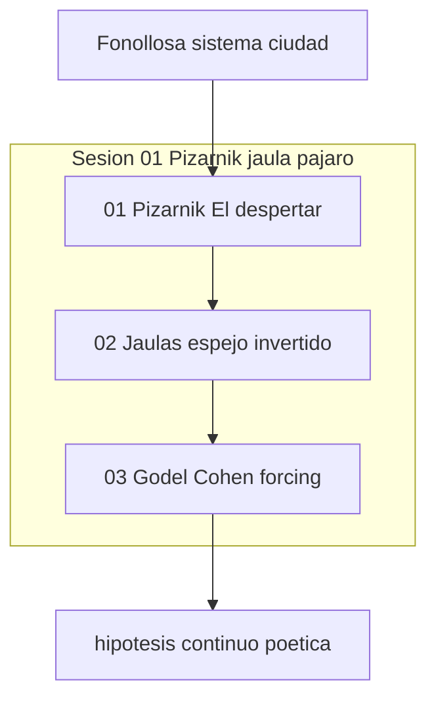

# INDICE — engine-model-F (Cohen Force poético-existencial)

## Rol en Modo Aleph

**Force F:** poética existencial — Pizarnik jaula-pájaro como forcing imaginativo
frente al sistema urbano de Fonollosa (Gödel) y la hipótesis del continuo poética.

Escena ancla: [`01-pizarnik-jaula-pajaro`](sesion-01-pizarnik-jaula-pajaro/01-pizarnik-jaula-pajaro/).

Registry: [`../manifest.json`](../manifest.json) · Ficha: [`engine.json`](engine.json).
Contraste sugerido: [`engine-model-D`](../engine-model-D/) (credos), [`sima-aleph`](../../sima-aleph/INDICE.md).

## Visión del hilo

El corpus [`raw/logs-agent-1.md`](raw/logs-agent-1.md) (163 líneas) parte de Fonollosa
y «Puedo empezar» para desplegar el poema «El despertar» de Pizarnik (jaula → pájaro),
contrasta dos jaulas espejo (ciudad compartida vs refugio íntimo), y cierra con la bisagra
alfa/omega Fonollosa-Gödel / Pizarnik-Cohen y el forcing ontológico del pájaro-jaula.

## Tabla de escenas

| ID | Escena | Rol | Resumen | Tags |
|----|--------|-----|---------|------|
| [f01-01](sesion-01-pizarnik-jaula-pajaro/01-pizarnik-jaula-pajaro/) | [01-pizarnik-jaula-pajaro](sesion-01-pizarnik-jaula-pajaro/01-pizarnik-jaula-pajaro/) | `ancla` | Pizarnik «El despertar» — jaula que se vuelve pájaro | `force:F`, `cohen:poetic_existential`, `Pizarnik`, `Fonollosa` |
| [f01-02](sesion-01-pizarnik-jaula-pajaro/02-jaulas-espejo-invertido/) | [02-jaulas-espejo-invertido](sesion-01-pizarnik-jaula-pajaro/02-jaulas-espejo-invertido/) | `contraste` | Dos jaulas espejo — Fonollosa afuera vs Pizarnik adentro | `force:F`, `cohen:poetic_existential`, `Pizarnik`, `Fonollosa` |
| [f01-03](sesion-01-pizarnik-jaula-pajaro/03-godel-cohen-forcing/) | [03-godel-cohen-forcing](sesion-01-pizarnik-jaula-pajaro/03-godel-cohen-forcing/) | `forcing` | Alfa/omega — Fonollosa-Gödel sistema vs Pizarnik-Cohen forcing | `force:F`, `cohen:poetic_existential`, `Pizarnik`, `Fonollosa` |

## Mapa conceptual



## Anomalías documentadas

- **f01-01** (01-pizarnik-jaula-pajaro): dialogo_plano_sin_think_explicito
- **f01-02** (02-jaulas-espejo-invertido): prompt_usuario_en_dos_bloques_lineas_52_54

## Guía de consulta

| Pregunta | Escena |
|----------|--------|
| ¿Jaula que se vuelve pájaro / «qué haré con el miedo»? | `01-pizarnik-jaula-pajaro/output.md` |
| ¿Fonollosa afuera vs Pizarnik adentro? | `02-jaulas-espejo-invertido/output.md` |
| ¿Gödel/Cohen, alfa-omega, forcing poético? | `03-godel-cohen-forcing/output.md` |

## Cobertura

- Líneas fuente: 163
- Líneas cubiertas: 163
- Verificación: OK

## Estructura

```
engine-model-F/
├── raw/logs-agent-1.md
├── segment_engine_model_f_log.py
├── manifest.json
├── INDICE.md
├── engine.json
└── sesion-01-pizarnik-jaula-pajaro/
```
