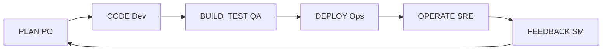

# INDICE — engine-model-G (Cohen Force bucle CI/CD ágil)

## Rol en Modo Aleph

**Force G:** lente de proceso — reparte la conversación en fases del pipeline
(PLAN→CODE→BUILD_TEST→DEPLOY→OPERATE→FEEDBACK) sin cambiar política del tablero.

Escena ancla: [`02-bucle-ideas-fuerza`](sesion-01-agile-cicd-loop/02-bucle-ideas-fuerza/).
Protocolo operativo: [`FORCING.md`](FORCING.md).

Registry: [`../manifest.json`](../manifest.json) · Ficha: [`engine.json`](engine.json).
Puente index-reader: poder `cicd-loop` en [`disfraz-rude-bot`](../../agents/skills/disfraz-rude-bot/).

## Visión del hilo

El corpus [`raw/logs-agent-1.md`](raw/logs-agent-1.md) (147 líneas) parte de arquetipos
ágiles en momentos de ceremonia, despliega el bucle CI/CD con ideas fuerza por rol,
y cierra con la misma ontología bajo trazabilidad epistemológica (🟢🟡🔴) del index-reader.

## Tabla de escenas

| ID | Escena | Rol | Resumen | Tags |
|----|--------|-----|---------|------|
| [g01-01](sesion-01-agile-cicd-loop/01-arquetipos-momento/) | [01-arquetipos-momento](sesion-01-agile-cicd-loop/01-arquetipos-momento/) | `contraste` | Arquetipos ágiles — minutos antes de la ceremonia | `force:G`, `cohen:agile_cicd_loop`, `ci-cd`, `scrum` |
| [g01-02](sesion-01-agile-cicd-loop/02-bucle-ideas-fuerza/) | [02-bucle-ideas-fuerza](sesion-01-agile-cicd-loop/02-bucle-ideas-fuerza/) | `ancla` | Bucle CI/CD — seis fases PLAN→FEEDBACK con ideas fuerza | `force:G`, `cohen:agile_cicd_loop`, `ci-cd`, `scrum` |
| [g01-03](sesion-01-agile-cicd-loop/03-trazabilidad-index-reader/) | [03-trazabilidad-index-reader](sesion-01-agile-cicd-loop/03-trazabilidad-index-reader/) | `forcing` | Misma ontología bajo 🟢🟡🔴 + traje index-reader | `force:G`, `cohen:agile_cicd_loop`, `ci-cd`, `scrum` |

## Mapa conceptual



## Anomalías documentadas

- **block-10 gemini** (reader-chain): descartado — corpus canónico solo en `raw/` + `sesion-01`
- **g01-01** (01-arquetipos-momento): dialogo_plano_sin_think_explicito, cabecera_export_lineas_1_3
- **g01-03** (03-trazabilidad-index-reader): synthetic_forcing_demo, dos_turnos_usuario_planner, viewed_trace_lineas_86_88

## Guía de consulta

| Pregunta | Escena |
|----------|--------|
| ¿Arquetipos antes de sprint/review/deploy? | `01-arquetipos-momento/output.md` |
| ¿Seis fases e ideas fuerza del bucle? | `02-bucle-ideas-fuerza/output.md` |
| ¿Bucle bajo 🟢🟡🔴 con traje reader? | `03-trazabilidad-index-reader/output.md` |

## Cobertura

- Líneas fuente: 147
- Líneas cubiertas: 147
- Verificación: OK

## Estructura

```
engine-model-G/
├── raw/logs-agent-1.md
├── segment_engine_model_g_log.py
├── FORCING.md
├── manifest.json
├── INDICE.md
├── engine.json
└── sesion-01-agile-cicd-loop/
```
