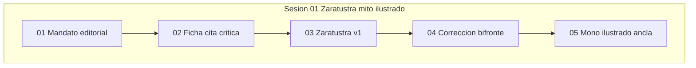

# INDICE — engine-model-XZ (Cohen Force myth_maker)

Proyecto cartesiano **XZ** · `transcardinal_index`: **n** · arc: **myth_maker**.

**Force XZ:** revisión editorial — mito Zaratustra/ASI/ciudadanía ilustrada,
construcción del «mono ilustrado» y el paso a «madre, hemos sido tontos».

Escena ancla: [`05-mono-ilustrado-hemos-sido-tontos`](sesion-01-zaratustra-mito-ilustrado/05-mono-ilustrado-hemos-sido-tontos/).

Registry: [`../manifest.json`](../manifest.json) · Ficha: [`engine.json`](engine.json).
Runbook: [`../RUNBOOK-indexar.md`](../RUNBOOK-indexar.md).
Sin `pairs_with` operativo a engine-model-ZX.

## Visión del hilo

El corpus [`raw/logs-agent1.md`](raw/logs-agent1.md) (220 líneas) parte de la crítica
al agente literario (NRx, ASI dada por sentada), despliega ficha de citación y revisión,
itera la analogía Zaratustra, absorbe la corrección bifronte del usuario y cierra con
el mito del mono ilustrado y el plural «hemos sido tontos».

## Tabla de escenas

| ID | Escena | Rol | Resumen | Tags |
|----|--------|-----|---------|------|
| [xz01-01](sesion-01-zaratustra-mito-ilustrado/01-mandato-editorial-parsing/) | [01-mandato-editorial-parsing](sesion-01-zaratustra-mito-ilustrado/01-mandato-editorial-parsing/) | `apertura` | Mandato editorial — parsing narcisista socio-demo-liberal | `force:XZ`, `cohen:myth_maker`, `Zaratustra`, `ASI` |
| [xz01-02](sesion-01-zaratustra-mito-ilustrado/02-ficha-cita-critica-agente/) | [02-ficha-cita-critica-agente](sesion-01-zaratustra-mito-ilustrado/02-ficha-cita-critica-agente/) | `diagnostico` | Ficha de citación + crítica al agente literario | `force:XZ`, `cohen:myth_maker`, `Zaratustra`, `ASI` |
| [xz01-03](sesion-01-zaratustra-mito-ilustrado/03-zaratustra-primera-version/) | [03-zaratustra-primera-version](sesion-01-zaratustra-mito-ilustrado/03-zaratustra-primera-version/) | `mito` | Zaratustra cuántico — primera versión mono vs superhombre | `force:XZ`, `cohen:myth_maker`, `Zaratustra`, `ASI` |
| [xz01-04](sesion-01-zaratustra-mito-ilustrado/04-correccion-bifronte-think/) | [04-correccion-bifronte-think](sesion-01-zaratustra-mito-ilustrado/04-correccion-bifronte-think/) | `pivot` | Corrección usuario — ambivalencia mono ilustrado (think) | `force:XZ`, `cohen:myth_maker`, `Zaratustra`, `ASI` |
| [xz01-05](sesion-01-zaratustra-mito-ilustrado/05-mono-ilustrado-hemos-sido-tontos/) | [05-mono-ilustrado-hemos-sido-tontos](sesion-01-zaratustra-mito-ilustrado/05-mono-ilustrado-hemos-sido-tontos/) | `ancla` | Humanidad mono ilustrado — de «he sido tonto» a «hemos sido tontos» | `force:XZ`, `cohen:myth_maker`, `Zaratustra`, `ASI` |

## Mapa conceptual



## Anomalías documentadas

- **xz01-01** (01-mandato-editorial-parsing): titulo_linea_1_no_es_prompt_usuario
- **xz01-02** (02-ficha-cita-critica-agente): continuacion_turno_sin_prompt_local
- **xz01-04** (04-correccion-bifronte-think): prompt_usuario_largo_multilinea

## Guía de consulta

| Pregunta | Escena |
|----------|--------|
| ¿Crítica al agente NRx / ficha de cita? | `02-ficha-cita-critica-agente/output.md` |
| ¿Zaratustra cuántico primera versión? | `03-zaratustra-primera-version/output.md` |
| ¿Mono ilustrado / hemos sido tontos? | `05-mono-ilustrado-hemos-sido-tontos/output.md` |

## Cobertura

- Líneas fuente: 220
- Líneas cubiertas: 220
- Verificación: OK

## Estructura

```
engine-model-XZ/
├── raw/logs-agent1.md
├── segment_engine_model_xz_log.py
├── manifest.json
├── INDICE.md
├── engine.json
└── sesion-01-zaratustra-mito-ilustrado/
```
