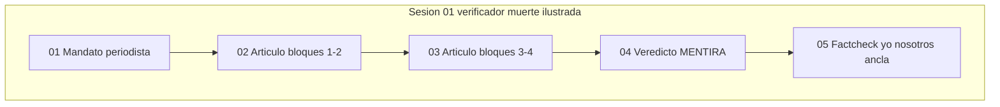

# INDICE — engine-model-ZX (Cohen Force argument_verifier)

Proyecto cartesiano **ZX** · `transcardinal_index`: **w** · arc: **debunker**.

**Force ZX:** periodista verificador — artículo de conjunto sobre el mito ilustrado,
veredicto verdad/mentira y refutación del paso yo→nosotros.

Escena ancla: [`05-factcheck-yo-nosotros`](sesion-01-verificador-muerte-ilustrada/05-factcheck-yo-nosotros/).

Registry: [`../manifest.json`](../manifest.json) · Ficha: [`engine.json`](engine.json).
Runbook: [`../RUNBOOK-indexar.md`](../RUNBOOK-indexar.md).
Sin `pairs_with` operativo a engine-model-XZ.

## Visión del hilo

El corpus [`raw/logs-agent1.md`](raw/logs-agent1.md) (187 líneas) sintetiza cinco bloques
de verificación argumental en un artículo periodístico, dictamina MENTIRA la tesis central
y refuta la operación retórica del singular al plural en «madre, hemos sido tontos».

## Tabla de escenas

| ID | Escena | Rol | Resumen | Tags |
|----|--------|-----|---------|------|
| [zx01-01](sesion-01-verificador-muerte-ilustrada/01-mandato-periodista/) | [01-mandato-periodista](sesion-01-verificador-muerte-ilustrada/01-mandato-periodista/) | `apertura` | Mandato periodista — síntesis bloques y verdad/mentira | `force:ZX`, `cohen:argument_verifier`, `verificador`, `bulo` |
| [zx01-02](sesion-01-verificador-muerte-ilustrada/02-articulo-bloques-inicial/) | [02-articulo-bloques-inicial](sesion-01-verificador-muerte-ilustrada/02-articulo-bloques-inicial/) | `articulo` | Artículo — bloques 1–2 (anuncio muerte + llanto Nietzsche) | `force:ZX`, `cohen:argument_verifier`, `verificador`, `bulo` |
| [zx01-03](sesion-01-verificador-muerte-ilustrada/03-articulo-bloques-medio/) | [03-articulo-bloques-medio](sesion-01-verificador-muerte-ilustrada/03-articulo-bloques-medio/) | `articulo` | Artículo — bloques 3–4 (mono bifronte + profecía apocalíptica) | `force:ZX`, `cohen:argument_verifier`, `verificador`, `bulo` |
| [zx01-04](sesion-01-verificador-muerte-ilustrada/04-veredicto-mentira-qa/) | [04-veredicto-mentira-qa](sesion-01-verificador-muerte-ilustrada/04-veredicto-mentira-qa/) | `veredicto` | Cuadro de conjunto + veredicto MENTIRA + apertura Q/A | `force:ZX`, `cohen:argument_verifier`, `verificador`, `bulo` |
| [zx01-05](sesion-01-verificador-muerte-ilustrada/05-factcheck-yo-nosotros/) | [05-factcheck-yo-nosotros](sesion-01-verificador-muerte-ilustrada/05-factcheck-yo-nosotros/) | `ancla` | Fact-checking yo→nosotros + refutación falacia ejemplaridad | `force:ZX`, `cohen:argument_verifier`, `verificador`, `bulo` |

## Mapa conceptual



## Anomalías documentadas

- **zx01-01** (01-mandato-periodista): titulo_linea_1_contexto_bloque
- **zx01-05** (05-factcheck-yo-nosotros): prompt_usuario_cita_bloque_previo

## Guía de consulta

| Pregunta | Escena |
|----------|--------|
| ¿Veredicto MENTIRA sobre democracia/ASI? | `04-veredicto-mentira-qa/output.md` |
| ¿Refutación yo→nosotros / falacia ejemplaridad? | `05-factcheck-yo-nosotros/output.md` |
| ¿Cuadro de conjunto cinco bloques? | `04-veredicto-mentira-qa/output.md` |

## Cobertura

- Líneas fuente: 187
- Líneas cubiertas: 187
- Verificación: OK

## Estructura

```
engine-model-ZX/
├── raw/logs-agent1.md
├── segment_engine_model_zx_log.py
├── manifest.json
├── INDICE.md
├── engine.json
└── sesion-01-verificador-muerte-ilustrada/
```
