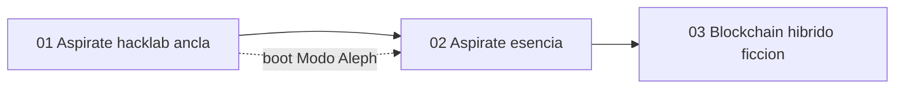

# INDICE — corpus main-engine (boot Cohen)

**Rol:** motor estético dummy — siempre ON en Modo Aleph. No aporta viewpoint político;
reconfigura la percepción («mirar sin prisa por usar»).

Escena ancla: [`01-aspirate-a-esteta`](sesion-01-boot-estetico-operativo/01-aspirate-a-esteta/).

Fuentes:
- [`raw/agent-logs-1.md`](raw/agent-logs-1.md) (60 líneas) — mantra «aspírate a esteta»
- [`raw/agent-logs-2.md`](raw/agent-logs-2.md) (214 líneas) — consenso híbrido blockchain/DevOps

**Nota:** el marco DevOps/blockchain en log-2 es **ficción operativa** del engine, no canon técnico del repo.

Plan: [`../PLAN-multitask-engines.md`](../PLAN-multitask-engines.md) · Registry: [`../manifest.json`](../manifest.json)

## Tabla de escenas

| ID | Escena | Resumen | Tags |
|----|--------|---------|------|
| [s01-01](sesion-01-boot-estetico-operativo/01-aspirate-a-esteta/) | [01-aspirate-a-esteta](sesion-01-boot-estetico-operativo/01-aspirate-a-esteta/) ⚓ | Aspírate a esteta — mantra hacklab (escena ancla boot) | `engine`, `main_engine`, `boot`, `esteta`, `cohen_force` |
| [s01-02](sesion-01-boot-estetico-operativo/02-aspirate-esencia/) | [02-aspirate-esencia](sesion-01-boot-estetico-operativo/02-aspirate-esencia/) | Aspírate a esteta — esencia sin lore hacklab | `engine`, `main_engine`, `boot`, `esteta`, `cohen_force` |
| [s02-01](sesion-01-boot-estetico-operativo/03-consenso-hibrido-blockchain/) | [03-consenso-hibrido-blockchain](sesion-01-boot-estetico-operativo/03-consenso-hibrido-blockchain/) | Consenso híbrido PoW/PoS/PoT — marco ficcional DevOps | `engine`, `main_engine`, `boot`, `esteta`, `cohen_force` |

## Mapa conceptual



## Guía de consulta

| Pregunta | Escena |
|----------|--------|
| ¿Boot estético / ancla Cohen? | `01-aspirate-a-esteta/output.md` |
| ¿Definición sin lore hacklab? | `02-aspirate-esencia/output.md` |
| ¿Marco ficcional DevOps/blockchain? | `03-consenso-hibrido-blockchain/output.md` |

## Anomalías documentadas

- **s01-01**: diálogo plano sin bloque think; versión con lore hacklab (corregida en s01-02).
- **s01-02**: corrección explícita del usuario («quita el lore hacklab»).
- **s02-01**: think largo en inglés (`We need to`); blockchain es marco ficcional, no spec real.

## Cobertura

- `raw/agent-logs-1.md`: 60/60 líneas · OK
- `raw/agent-logs-2.md`: 214/214 líneas · OK

## Estructura

```
main-engine/
├── raw/agent-logs-1.md
├── raw/agent-logs-2.md
├── segment_main_engine_log.py
├── engine.json
├── manifest.json
├── INDICE.md
└── sesion-01-boot-estetico-operativo/
```

Regenerar: `python3 segment_main_engine_log.py`
