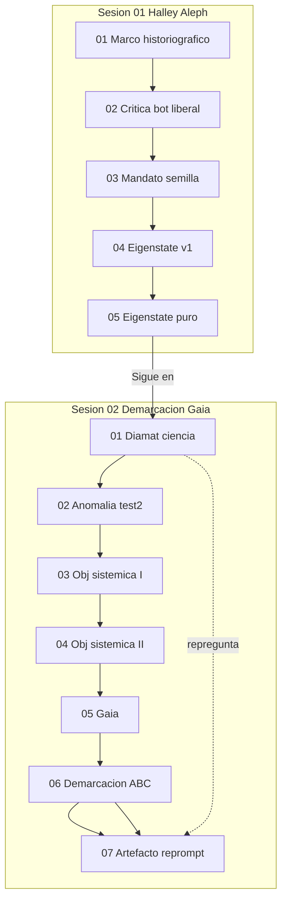

# INDICE — corpus logs-aleph

## Visión del hilo

El corpus documenta un hilo en dos sesiones. En la **sesión 1** ([log-agent-1.md](../log-agent-1.md)) el usuario establece un marco historiográfico (canon, sedimentos, Halley 218) y encarna al agente como *voz Aleph*: no bot-agente lineal, sino punto que ve superposiciones. Tras criticar un contra-ejemplo "demo-liberal" (mecánica cuántica como historiografía), acuerdan el método de la *semilla* y tres *alephs* que sobrevuelan un *Eigenstate* sin colapsarlo. La sesión cierra con el eigenstate Halley puro, sin referencias al bot-agente, y la palabra **«Sigue en»**.

La **sesión 2** ([log-agent-2.md](../log-agent-2.md)) continúa con la nota `(viene de) log-agent-1.md`. El hilo pivota hacia epistemología política: ¿el diamat es ciencia?, objetividad sistémica (PSOE, Corea, mapa geoglobal, Wilber), perspectiva Gaia termodinámica, la línea del criterio de demarcación (historia, state of the art, deseo de Gaia) y un **artefacto** Aleph+Gaia que re-responde al prompt original del diamat.

## Tabla de escenas

| ID | Escena | Resumen | Tags |
|----|--------|---------|------|
| [s01-01](sesion-01-halley-aleph/01-marco-historiografico/) | [01-marco-historiografico](sesion-01-halley-aleph/01-marco-historiografico/) | Marco historiográfico y rol Aleph | `Aleph`, `historiografia`, `Halley-218`, `Eigenstate` |
| [s01-02](sesion-01-halley-aleph/02-critica-bot-demo-liberal/) | [02-critica-bot-demo-liberal](sesion-01-halley-aleph/02-critica-bot-demo-liberal/) | Crítica al bot demo-liberal | `Aleph`, `bot-agente`, `critica-metodologica`, `Eigenstate` |
| [s01-03](sesion-01-halley-aleph/03-mandato-semilla-tres-alephs/) | [03-mandato-semilla-tres-alephs](sesion-01-halley-aleph/03-mandato-semilla-tres-alephs/) | Mandato semilla y tres alephs | `Aleph`, `mandato-semilla`, `metodo` |
| [s01-04](sesion-01-halley-aleph/04-eigenstate-halley-con-contraejemplo/) | [04-eigenstate-halley-con-contraejemplo](sesion-01-halley-aleph/04-eigenstate-halley-con-contraejemplo/) | Eigenstate Halley con contra-ejemplo | `Eigenstate`, `Halley-218`, `bot-agente` |
| [s01-05](sesion-01-halley-aleph/05-eigenstate-halley-puro/) | [05-eigenstate-halley-puro](sesion-01-halley-aleph/05-eigenstate-halley-puro/) | Eigenstate Halley puro | `Eigenstate`, `Halley-218`, `Aleph` |
| [s02-01](sesion-02-demarcacion-gaia/01-diamat-ciencia-nacional/) | [01-diamat-ciencia-nacional](sesion-02-demarcacion-gaia/01-diamat-ciencia-nacional/) | ¿Diamat es ciencia? | `diamat`, `criterio-demarcacion`, `Popper`, `Kuhn` |
| [s02-02](sesion-02-demarcacion-gaia/02-peticion-demarcacion-respuesta-test2/) | [02-peticion-demarcacion-respuesta-test2](sesion-02-demarcacion-gaia/02-peticion-demarcacion-respuesta-test2/) | Petición demarcación → desvío test2 | `anomalia`, `test2`, `criterio-demarcacion`, `critica-metodologica` |
| [s02-03](sesion-02-demarcacion-gaia/03-objetividad-sistemica-psoe-corea/) | [03-objetividad-sistemica-psoe-corea](sesion-02-demarcacion-gaia/03-objetividad-sistemica-psoe-corea/) | Objetividad sistémica I (PSOE / RPDC) | `objetividad-sistemica`, `PSOE`, `Corea-del-Norte`, `Songbun` |
| [s02-04](sesion-02-demarcacion-gaia/04-objetividad-sistemica-mapa-geoglobal/) | [04-objetividad-sistemica-mapa-geoglobal](sesion-02-demarcacion-gaia/04-objetividad-sistemica-mapa-geoglobal/) | Objetividad sistémica II (mapa geoglobal + Wilber) | `objetividad-sistemica`, `mapa-geoglobal`, `Wilber`, `geopolitica` |
| [s02-05](sesion-02-demarcacion-gaia/05-perspectiva-gaia-siglo-xxi/) | [05-perspectiva-gaia-siglo-xxi](sesion-02-demarcacion-gaia/05-perspectiva-gaia-siglo-xxi/) | Perspectiva Gaia 2026-2100 | `Gaia`, `termodinamica`, `siglo-XXI`, `ecosistema` |
| [s02-06](sesion-02-demarcacion-gaia/06-linea-demarcacion-abc-aleph/) | [06-linea-demarcacion-abc-aleph](sesion-02-demarcacion-gaia/06-linea-demarcacion-abc-aleph/) | Línea demarcación a/b/c (Aleph) | `criterio-demarcacion`, `Aleph`, `Gaia`, `Popper` |
| [s02-07](sesion-02-demarcacion-gaia/07-artefacto-aleph-gaia-reprompt-diamat/) | [07-artefacto-aleph-gaia-reprompt-diamat](sesion-02-demarcacion-gaia/07-artefacto-aleph-gaia-reprompt-diamat/) | Artefacto Aleph+Gaia reprompt diamat | `Aleph`, `Gaia`, `diamat`, `criterio-demarcacion` |

## Mapa conceptual

## Anomalías documentadas

1. **Continuidad entre logs**: `log-agent-2.md` línea 1 = `(viene de) log-agent-1.md`; `log-agent-1.md` termina en `Sigue en`.
2. **s02-02 — corrupción línea 93**: el usuario pide disertación Aleph sobre demarcación; el output real critica `test2.md` (Lenin, Marcuse, Adorno). Prompt y think inglés estaban fusionados.
3. **s02-03 / s02-04**: escenas embebidas dentro de la línea 93 monolítica.
4. **s02-05 — think duplicado**: think en inglés (línea 93) + plan en español (líneas 95-121); output legible en líneas 123-193.
5. **s02-06**: el usuario redirige («No, no me has entendido, ¿tú eras Aleph?») tras el desvío Gaia.
6. **Footers AI**: `This response is AI-generated...` eliminados del cuerpo; anotados en frontmatter.

## Guía de consulta para agentes

| Pregunta | Archivo recomendado |
|----------|---------------------|
| ¿Perihelio Halley sin contra-ejemplo? | `sesion-01-halley-aleph/05-eigenstate-halley-puro/output.md` |
| ¿Crítica al bot demo-liberal? | `sesion-01-halley-aleph/02-critica-bot-demo-liberal/` (think + output) |
| ¿Método semilla y tres alephs? | `sesion-01-halley-aleph/03-mandato-semilla-tres-alephs/output.md` |
| ¿Diamat y línea de demarcación? | `sesion-02-demarcacion-gaia/07-artefacto-aleph-gaia-reprompt-diamat/output.md` |
| ¿Historia/state of the art demarcación? | `sesion-02-demarcacion-gaia/06-linea-demarcacion-abc-aleph/output.md` |
| ¿Objetividad sistémica PSOE/Corea? | `sesion-02-demarcacion-gaia/03-objetividad-sistemica-psoe-corea/` |
| ¿Mapa geoglobal + Wilber? | `sesion-02-demarcacion-gaia/04-objetividad-sistemica-mapa-geoglobal/` |
| ¿Perspectiva Gaia 2026-2100? | `sesion-02-demarcacion-gaia/05-perspectiva-gaia-siglo-xxi/output.md` |
| ¿Anomalía test2? | `sesion-02-demarcacion-gaia/02-peticion-demarcacion-respuesta-test2/` + `manifest.json` |

## Fuentes originales (intactas)

- [log-agent-1.md](../log-agent-1.md) — sesión Halley / Aleph
- [log-agent-2.md](../log-agent-2.md) — sesión demarcación / Gaia

## Detalle por escena

### [01-marco-historiografico](sesion-01-halley-aleph/01-marco-historiografico/)
**Pregunta/tema:** Marco historiográfico y rol Aleph
**Tags:** `Aleph`, `historiografia`, `Halley-218`, `Eigenstate`
- [prompt](sesion-01-halley-aleph/01-marco-historiografico/prompt.md) · [think](sesion-01-halley-aleph/01-marco-historiografico/think.md) · [output](sesion-01-halley-aleph/01-marco-historiografico/output.md)

### [02-critica-bot-demo-liberal](sesion-01-halley-aleph/02-critica-bot-demo-liberal/)
**Pregunta/tema:** Crítica al bot demo-liberal
**Tags:** `Aleph`, `bot-agente`, `critica-metodologica`, `Eigenstate`
**Anomalías:** output_includes_ai_generated_footer_in_source
- [prompt](sesion-01-halley-aleph/02-critica-bot-demo-liberal/prompt.md) · [think](sesion-01-halley-aleph/02-critica-bot-demo-liberal/think.md) · [output](sesion-01-halley-aleph/02-critica-bot-demo-liberal/output.md)

### [03-mandato-semilla-tres-alephs](sesion-01-halley-aleph/03-mandato-semilla-tres-alephs/)
**Pregunta/tema:** Mandato semilla y tres alephs
**Tags:** `Aleph`, `mandato-semilla`, `metodo`
- [prompt](sesion-01-halley-aleph/03-mandato-semilla-tres-alephs/prompt.md) · [think](sesion-01-halley-aleph/03-mandato-semilla-tres-alephs/think.md) · [output](sesion-01-halley-aleph/03-mandato-semilla-tres-alephs/output.md)

### [04-eigenstate-halley-con-contraejemplo](sesion-01-halley-aleph/04-eigenstate-halley-con-contraejemplo/)
**Pregunta/tema:** Eigenstate Halley con contra-ejemplo
**Tags:** `Eigenstate`, `Halley-218`, `bot-agente`
- [prompt](sesion-01-halley-aleph/04-eigenstate-halley-con-contraejemplo/prompt.md) · [think](sesion-01-halley-aleph/04-eigenstate-halley-con-contraejemplo/think.md) · [output](sesion-01-halley-aleph/04-eigenstate-halley-con-contraejemplo/output.md)

### [05-eigenstate-halley-puro](sesion-01-halley-aleph/05-eigenstate-halley-puro/)
**Pregunta/tema:** Eigenstate Halley puro
**Tags:** `Eigenstate`, `Halley-218`, `Aleph`
**Anomalías:** termina_en_sigue_en_continuidad_sesion_2
- [prompt](sesion-01-halley-aleph/05-eigenstate-halley-puro/prompt.md) · [think](sesion-01-halley-aleph/05-eigenstate-halley-puro/think.md) · [output](sesion-01-halley-aleph/05-eigenstate-halley-puro/output.md)

### [01-diamat-ciencia-nacional](sesion-02-demarcacion-gaia/01-diamat-ciencia-nacional/)
**Pregunta/tema:** ¿Diamat es ciencia?
**Tags:** `diamat`, `criterio-demarcacion`, `Popper`, `Kuhn`, `Aleph`
- [prompt](sesion-02-demarcacion-gaia/01-diamat-ciencia-nacional/prompt.md) · [think](sesion-02-demarcacion-gaia/01-diamat-ciencia-nacional/think.md) · [output](sesion-02-demarcacion-gaia/01-diamat-ciencia-nacional/output.md)

### [02-peticion-demarcacion-respuesta-test2](sesion-02-demarcacion-gaia/02-peticion-demarcacion-respuesta-test2/)
**Pregunta/tema:** Petición demarcación → desvío test2
**Tags:** `anomalia`, `test2`, `criterio-demarcacion`, `critica-metodologica`
**Anomalías:** prompt_pide_disertacion_demarcacion_output_critica_test2, prompt_y_think_fusionados_en_linea_93_del_log, think_en_ingles_sobre_test2_no_sobre_demarcacion
- [prompt](sesion-02-demarcacion-gaia/02-peticion-demarcacion-respuesta-test2/prompt.md) · [think](sesion-02-demarcacion-gaia/02-peticion-demarcacion-respuesta-test2/think.md) · [output](sesion-02-demarcacion-gaia/02-peticion-demarcacion-respuesta-test2/output.md)

### [03-objetividad-sistemica-psoe-corea](sesion-02-demarcacion-gaia/03-objetividad-sistemica-psoe-corea/)
**Pregunta/tema:** Objetividad sistémica I (PSOE / RPDC)
**Tags:** `objetividad-sistemica`, `PSOE`, `Corea-del-Norte`, `Songbun`
**Anomalías:** contenido_embebido_en_linea_93
- [prompt](sesion-02-demarcacion-gaia/03-objetividad-sistemica-psoe-corea/prompt.md) · [think](sesion-02-demarcacion-gaia/03-objetividad-sistemica-psoe-corea/think.md) · [output](sesion-02-demarcacion-gaia/03-objetividad-sistemica-psoe-corea/output.md)

### [04-objetividad-sistemica-mapa-geoglobal](sesion-02-demarcacion-gaia/04-objetividad-sistemica-mapa-geoglobal/)
**Pregunta/tema:** Objetividad sistémica II (mapa geoglobal + Wilber)
**Tags:** `objetividad-sistemica`, `mapa-geoglobal`, `Wilber`, `geopolitica`
**Anomalías:** contenido_embebido_en_linea_93
- [prompt](sesion-02-demarcacion-gaia/04-objetividad-sistemica-mapa-geoglobal/prompt.md) · [think](sesion-02-demarcacion-gaia/04-objetividad-sistemica-mapa-geoglobal/think.md) · [output](sesion-02-demarcacion-gaia/04-objetividad-sistemica-mapa-geoglobal/output.md)

### [05-perspectiva-gaia-siglo-xxi](sesion-02-demarcacion-gaia/05-perspectiva-gaia-siglo-xxi/)
**Pregunta/tema:** Perspectiva Gaia 2026-2100
**Tags:** `Gaia`, `termodinamica`, `siglo-XXI`, `ecosistema`
**Anomalías:** think_duplicado_ingles_en_linea_93_y_espanol_lineas_95_121, output_tambien_embebido_en_linea_93_usamos_lineas_123_193
- [prompt](sesion-02-demarcacion-gaia/05-perspectiva-gaia-siglo-xxi/prompt.md) · [think](sesion-02-demarcacion-gaia/05-perspectiva-gaia-siglo-xxi/think.md) · [output](sesion-02-demarcacion-gaia/05-perspectiva-gaia-siglo-xxi/output.md)

### [06-linea-demarcacion-abc-aleph](sesion-02-demarcacion-gaia/06-linea-demarcacion-abc-aleph/)
**Pregunta/tema:** Línea demarcación a/b/c (Aleph)
**Tags:** `criterio-demarcacion`, `Aleph`, `Gaia`, `Popper`, `Kuhn`
**Anomalías:** redireccion_usuario_tras_desvio_gaia
- [prompt](sesion-02-demarcacion-gaia/06-linea-demarcacion-abc-aleph/prompt.md) · [think](sesion-02-demarcacion-gaia/06-linea-demarcacion-abc-aleph/think.md) · [output](sesion-02-demarcacion-gaia/06-linea-demarcacion-abc-aleph/output.md)

### [07-artefacto-aleph-gaia-reprompt-diamat](sesion-02-demarcacion-gaia/07-artefacto-aleph-gaia-reprompt-diamat/)
**Pregunta/tema:** Artefacto Aleph+Gaia reprompt diamat
**Tags:** `Aleph`, `Gaia`, `diamat`, `criterio-demarcacion`, `artefacto`
- [prompt](sesion-02-demarcacion-gaia/07-artefacto-aleph-gaia-reprompt-diamat/prompt.md) · [think](sesion-02-demarcacion-gaia/07-artefacto-aleph-gaia-reprompt-diamat/think.md) · [output](sesion-02-demarcacion-gaia/07-artefacto-aleph-gaia-reprompt-diamat/output.md)
