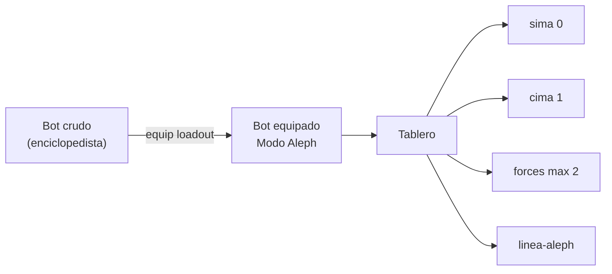

# Contraplan: juego + prensa + FOSS (vs PLAN.md)

Fichero destino: [`PLAN-CONTRAPLAN.md`](PLAN-CONTRAPLAN.md) en la raíz de SCRIPTORIUM, como alternativa explícita a [`PLAN.md`](PLAN.md).

**Identidad del repo:** `BOT_ALEPH` local = repo GitHub `network-engine`. Sin producto ni personaje nuevo; solo corrección metafórica del lenguaje.

---

## Qué corrige respecto a PLAN.md

| Tema | PLAN.md | Contraplan |
|------|---------|------------|
| Activación | Pipeline largo tipo [`ACTIVACION.md`](BOT_ALEPH/aleph-context/ACTIVACION.md) (7+ pasos) | **Equipamiento instantáneo** — un loadout serializado que el agente aplica en un gesto |
| Metáfora visual | "Exhibición" genérica | **Traje rude-bot** — equipamiento crudo del bot; explícitamente **no** superhéroe, **no** superpoderes |
| Portal público | `exhibicion/` | **`prensa/`** — mismo patrón MEDIDOR, nombre conservado |
| Prensa | Catálogo de sesiones/engines | Showcase estático del acceso a Modo Aleph **+** todo el material indexado (engines, corpus, línea, cotas) |
| FOSS | Descrito pero genérico | **Clon estricto** del patrón MEDIDOR: `llms.md`, `foss/tecnico|funcional|devops`, `docs/prompts/` operativos |

---

## Metáfora: traje rude-bot (solo lenguaje)

En la conversación previa se usó "traje de superhéroe" como metáfora del skill. El contraplan **rechaza** ese marco:

- **No:** bot que se viste de superhéroe y gana superpoderes para activar Modo Aleph
- **Sí:** bot crudo que **se equipa** con un traje rude-bot — procedimiento + estado mínimo, sin promesa de omnisciencia

El traje rude-bot es el **skill `modo-aleph` + loadout** (perfil, engines, cotas), no un personaje de marca ni un nombre de producto.



---

## Modelo de juego (diseño central)

Objetivo: modelar el tablero como **juego sin victoria** — el agente juega turnos de refracción, no cierra expedientes.

### Piezas del tablero

| Pieza | Fuente BOT_ALEPH | Rol en el juego |
|-------|------------------|-----------------|
| **Tablero** | skill [`SKILL.md`](BOT_ALEPH/.cursor/skills/modo-aleph/SKILL.md) | Plano donde coexisten superposiciones sin colapsar |
| **Jugadores** | `aleph-context/profiles/{slug}.json` | Agentes con polo tentado y sesgos (fichas de jugador) |
| **Semilla** | tema del turno / prompt-test | Pieza que abre el turno |
| **3 Alephs** | pipeline §5 del skill | Fichas de refracción interna |
| **Cotas** | [`cotas.md`](BOT_ALEPH/.cursor/skills/modo-aleph/cotas.md) + `posicion-linea.json` | Eje vertical sima (0) ↔ cima (1) |
| **Línea** | [`linea-aleph/`](BOT_ALEPH/linea-aleph/INDICE.md) | Eje histórico de demarcación (tiempo) |
| **Engines** | [`engines/manifest.json`](BOT_ALEPH/engines/manifest.json) — 8 indexados | Forces Cohen: main-engine (boot, siempre ON) + ≤2 forces |
| **AutoRevisor** | [`autorevisor.md`](BOT_ALEPH/.cursor/skills/modo-aleph/autorevisor.md) | Reglas del turno (checklist simétrico) |
| **Turno** | `ASENTAMIENTO_ALEPH` + delta en `sessions/` | Equipar → refractar → no cerrar |

### Disfraz instantáneo: loadout

Sustituir la activación multi-paso por un artefacto **loadout** precompuesto:

```json
{
  "loadout_id": "default-tablero",
  "skill": "modo-aleph",
  "profile_ref": "profiles/composer.json",
  "engines_active": { "main_engine": "on", "forces": ["engine-model-A"] },
  "posicion_linea": 0.5,
  "anchor_scenes": ["engines/main-engine/.../01-aspirate-a-esteta"],
  "asentamiento_template": "asentamiento-plantilla.md"
}
```

**Un gesto de equipamiento** (CLI o prompt único):

```bash
nengine loadout apply default-tablero --semilla "tema del usuario"
```

Equivalente para agente: *"Lee `data/loadouts/default-tablero.json` y aplica; emite `ASENTAMIENTO_ALEPH`; no analices hasta equipado."*

Loadouts predefinidos en `data/loadouts/` (semilla Composer, forces A+E, cotas calibración, etc.). El motor valida contra [`profile.schema.json`](BOT_ALEPH/aleph-context/templates/profile.schema.json) y [`engine.schema.json`](BOT_ALEPH/engines/engine.schema.json).

**Qué se conserva del pipeline actual:** boot main-engine, AutoRevisor, cotas, tablero — pero **empaquetados**, no recalculados paso a paso cada sesión si el perfil ya existe.

---

## Arquitectura dual (patrón MEDIDOR, sin desviaciones)

Misma estructura que [MEDIDOR-LAWFER](SENSORES/MEDIDOR-LAWFER):

```
data/ + site/ (Jinja2) → nengine build → public/ → GitHub Pages
```

Tres portales en `public/`:

| Portal | Ruta | Función |
|--------|------|---------|
| Índice | `index.html` | Puerta: prensa + FOSS |
| **Prensa** | `prensa/` | Showcase + corpus indexado + sesiones publicadas |
| **FOSS** | `foss/` | Artefacto técnico/funcional estricto |

**Enlace github.io → github.com/main:** cada ficha prensa y cada prompt FOSS lleva `ext-link` a `https://github.com/alephscriptorium-eng/network-engine/blob/main/{path}` — patrón ya usado en MEDIDOR (`github_blob()` en [`foss_context.py`](SENSORES/MEDIDOR-LAWFER/medidor_lawfare/site/foss_context.py)).

---

## Prensa: dos bloques obligatorios

### A) Showcase estático del equipamiento (traje rude-bot)

Página hero en `prensa/equipamiento/index.html` — **HTML/CSS estático**, visualmente potente, sin JS pesado:

- **Antes:** bot crudo (referencia escena s01-02 logs-aleph — cota del demo-liberal)
- **Equipar:** diagrama del loadout (skill + perfil + engines + cotas)
- **Después:** bloque `ASENTAMIENTO_ALEPH` de ejemplo (desde [`asentamiento.md`](BOT_ALEPH/logs-skill/sesion-04-skill-modo-aleph/01-autorevisor-tablero-skill/asentamiento.md))
- **Features del traje:** lista visual (tablero, AutoRevisor, forces, línea, sima/cima) — capacidades operativas, no "superpoderes"

Assets: SVG del tablero (eje sima–cima, línea horizontal, fichas engines). Opcional: CSS `@keyframes` sutil para transición equipar (sigue siendo estático en deploy).

### B) Corpus indexado completo

Toda la parte ya indexada en BOT_ALEPH debe tener ficha navegable en prensa, con enlace a `blob/main`:

| Sección prensa | Fuente | Contenido por ficha |
|----------------|--------|---------------------|
| `prensa/engines/` | `engines/manifest.json` + 8 INDICE | Rol, triggers, escena ancla, pairs_with, enlace escena en GitHub |
| `prensa/corpus/logs-aleph/` | manifest + INDICE | Escenas ancla, tags |
| `prensa/corpus/sima-aleph/` | idem | Cota 0 |
| `prensa/corpus/cima-aleph/` | idem | Cota 1 |
| `prensa/corpus/linea-aleph/` | manifest + ontology-seeds | Registros como enlaces GitHub (no duplicar 600k líneas en HTML) |
| `prensa/corpus/logs-skill/` | INDICE | Meta-corpus de diseño |
| `prensa/tablero/` | skill + cotas | Diagrama del juego y reglas en lenguaje prensa |
| `prensa/sesiones/` | `data/sessions/` + catalog | Sesiones publicadas del tablero |

`data/catalog.json` sincronizado por `nengine catalog sync` — análogo a MEDIDOR.

---

## FOSS: estricto como MEDIDOR

Copiar estructura probada, adaptando dominio:

### Raíz

- [`llms.md`](SENSORES/MEDIDOR-LAWFER/llms.md) — onboarding agente: qué es el artefacto vs prensa, rama `main`, CI Pages, estructura, CLI, prompts
- `pyproject.toml` → CLI `nengine`
- `CITATION.cff`, `CHANGELOG.md`, GPL-3.0

### `public/foss/` (generado)

| Página | Contenido |
|--------|-----------|
| `index.html` | Visión artefacto network-engine |
| `tecnico.html` | Motor: loadout, tablero, engines, cotas, schemas |
| `funcional.html` | Pipeline: equipar → asentamiento → autorevisor → tablero |
| `devops.html` | CLI, Pages, workflows, **prompts operativos con enlace GitHub** |
| `datos-publicados.html` | Qué hay en `data/` y qué se publica en prensa |
| `LICENSE.html` | Licencia |
| `llms.md` | Copia o render del raíz |

### `docs/prompts/` (operación)

Análogo a MEDIDOR — plantillas con `{{variables}}`:

| Prompt | Uso |
|--------|-----|
| `equipar_loadout.prompt.md` | Agente externo: aplicar loadout + emitir ASENTAMIENTO |
| `iniciar_turno.prompt.md` | Turno tablero con semilla y forces |
| `calibrar_cotas.prompt.md` | Oscilación sima–cima (prompt-test 02) |
| `activar_forces.prompt.md` | Selección ≤2 forces (prompt-test 03) |
| `publicar_sesion_prensa.prompt.md` | Depositar sesión en `data/sessions/.../prensa/` |
| `lectura_pack_tablero.prompt.md` | Pack ZIP → lectura ciudadana del tablero (análogo `lectura_pack_ciudadano`) |

`network_engine/site/foss_context.py` lista prompts con `github_blob()` — mismo patrón que MEDIDOR.

### Motor Python (`network_engine/`)

Módulos mínimos para que FOSS sea **funcional**, no solo documentación:

- `tablero/loadout.py` — validar y aplicar loadout
- `tablero/engines.py` — leer registry, budget max 2 forces
- `tablero/posicion.py` — arco 0.0–1.0
- `tablero/autorevisor.py` — checklist
- `catalog/sync.py` — `catalog.json` desde engines + corpus + sessions
- `cli/build.py` — `build_prensa()`, `build_foss()`, `build_root()` (copiar esqueleto MEDIDOR)

---

## Mapeo BOT_ALEPH → network-engine

Igual que PLAN.md en metadata, con énfasis en loadouts y catalog prensa:

| Local BOT_ALEPH | Repo network-engine |
|-----------------|---------------------|
| `.cursor/skills/modo-aleph/` | `docs/metodologia/` + empaquetado en loadout |
| `engines/` | `data/engines/` (manifest + engine.json; raw en repo o LFS según tamaño) |
| `aleph-context/templates/` | `data/schema/` + `data/loadouts/` |
| `logs-aleph/`, `sima-aleph/`, `cima-aleph/`, `logs-skill/` | `data/corpus/{name}/` — manifest + INDICE; escenas ancla en repo |
| `linea-aleph/` | `data/corpus/linea/` — manifest + ontology-seeds; registros enlazados desde prensa |
| Perfiles operativos vivos | `data/profiles/` (ejemplos, no secretos) |

---

## Fases de ejecución (orden del contraplan)

### Fase 0 — Documento

Escribir [`PLAN-CONTRAPLAN.md`](PLAN-CONTRAPLAN.md) con este contenido; dejar [`PLAN.md`](PLAN.md) intacto como plan alternativo (motor-first / exhibicion).

### Fase 1 — Infra MEDIDOR

Clonar esqueleto: `paths.py`, `build.py`, `brand.py`, `pages.yml`, templates `_partials/`, CSS base Scriptorium.

### Fase 2 — Loadout + motor tablero

Schemas `loadout.schema.json`, `data/loadouts/default-tablero.json`, CLI `nengine loadout apply|validate`.

### Fase 3 — Catalog + prensa build

`catalog.json` desde [`engines/manifest.json`](BOT_ALEPH/engines/manifest.json) y corpus INDICE; templates prensa (equipamiento showcase + fichas engine + corpus).

### Fase 4 — FOSS estricto

`llms.md`, `docs/prompts/*`, `foss_context.py`, páginas tecnico/funcional/devops.

### Fase 5 — Primera publicación

`nengine build --target all` → push `main` → GitHub Pages; verificar enlaces `blob/main` desde prensa.

---

## Relación entre los dos planes

- **PLAN.md:** producto network-engine, portal `exhibicion/`, activación pipeline clásica — **archivado** en [logs-skill/s05-01](../BOT_ALEPH/logs-skill/sesion-05-genesis-network-engine/01-cierre-plan-md/) y **eliminado** del repo (jun 2026)
- **PLAN2.md** (este fichero; antes `PLAN-CONTRAPLAN.md` en raíz): mismo repo, énfasis juego + loadout instantáneo + `prensa/` + showcase equipamiento (traje rude-bot) + FOSS clon MEDIDOR — **conservar** como anexo histórico
- **PLAN3.md:** plan integrado canónico vivo — ver [`PLAN3.md`](PLAN3.md)

No son excluyentes en código: comparten motor Python; divergen en UX de activación, naming del portal público y narrativa prensa. Las decisiones ganadoras (prensa, loadout, corpus in situ) están consolidadas en PLAN3.
