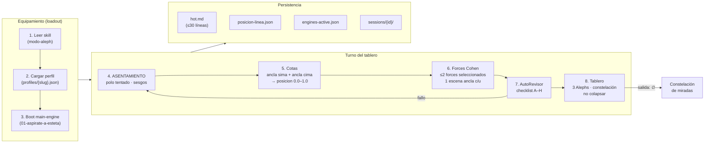
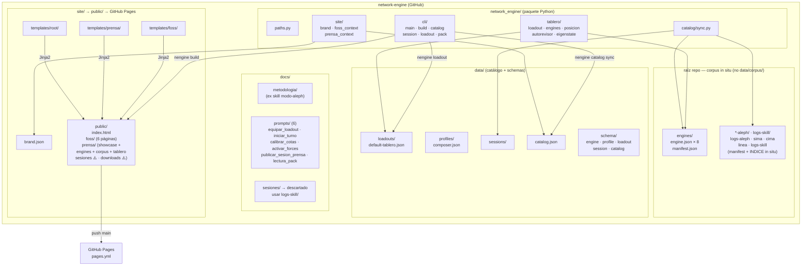

# Plan de producto integrado: BOT_ALEPH → `network-engine`

Plan que unifica [PLAN.md archivado en logs-skill/s05-01](../BOT_ALEPH/logs-skill/sesion-05-genesis-network-engine/01-cierre-plan-md/) + [PLAN2.md](PLAN2.md) (contraplan), con auditoría técnica completa del estado actual. **Plan canónico vivo** tras cierre GENESIS (jun 2026).

---

## 1. Auditoría completa de BOT_ALEPH

### Inventario de componentes

| # | Componente | Path | Escenas | Líneas raw | Manifest | INDICE | Scripts | Estado |
|---|-----------|------|---------|------------|----------|--------|---------|--------|
| 1 | **agents/skills/modo-aleph** | [agents/skills/modo-aleph/](../BOT_ALEPH/agents/skills/modo-aleph) | — | — | — | — | — | ✅ 6 archivos (SKILL, autorevisor, cotas, engines, asentamiento-plantilla, referencia-logs) |
| 2 | **agents/skills/linea-aleph-browser** | [agents/skills/linea-aleph-browser/](../BOT_ALEPH/agents/skills/linea-aleph-browser) | — | — | — | — | `fetch_snapshot.py` | ✅ SKILL + 1 script |
| 3 | **engines** | [engines/](../BOT_ALEPH/engines) | 39 | 3385 | ✅ [manifest.json](../BOT_ALEPH/engines/manifest.json) | ✅ [INDICE.md](../BOT_ALEPH/engines/INDICE.md) | 8 segment scripts | ✅ 8/8 indexed, coverage OK |
| 4 | **logs-aleph** | [logs-aleph/](../BOT_ALEPH/logs-aleph) | 12 | ~800 | ✅ [manifest.json](../BOT_ALEPH/logs-aleph/manifest.json) | ✅ [INDICE.md](../BOT_ALEPH/logs-aleph/INDICE.md) | `segment_logs.py` | ✅ indexed, 6 anomalías documentadas |
| 5 | **sima-aleph** | [sima-aleph/](../BOT_ALEPH/sima-aleph) | 10 | 1139 | ✅ [manifest.json](../BOT_ALEPH/sima-aleph/manifest.json) | ✅ [INDICE.md](../BOT_ALEPH/sima-aleph/INDICE.md) | `segment_sima_log.py` | ✅ 1139/1139 coverage OK |
| 6 | **cima-aleph** | [cima-aleph/](../BOT_ALEPH/cima-aleph) | 4 | ~500 | ✅ [manifest.json](../BOT_ALEPH/cima-aleph/manifest.json) | ✅ [INDICE.md](../BOT_ALEPH/cima-aleph/INDICE.md) | `segment_cima_log.py` | ✅ indexed, 4 anomalías |
| 7 | **linea-aleph** | [linea-aleph/](../BOT_ALEPH/linea-aleph) | 677 registros | 615k manifest | ✅ [manifest.json](../BOT_ALEPH/linea-aleph/manifest.json) (615k) | ✅ [INDICE.md](../BOT_ALEPH/linea-aleph/INDICE.md) | `segment_linea.py` + `fetch_snapshot.py` | ✅ 99 milestones marcados |
| 8 | **logs-skill** | [logs-skill/](../BOT_ALEPH/logs-skill) | 11 | ~900 | ✅ [manifest.json](../BOT_ALEPH/logs-skill/manifest.json) | ✅ [INDICE.md](../BOT_ALEPH/logs-skill/INDICE.md) | `segment_skill_log.py` | ✅ indexed, 5 sesiones, 5 anomalías |
| 9 | **aleph-context** | [aleph-context/](../BOT_ALEPH/aleph-context) | — | — | — | — | — | ⚠️ Estado de tablero: templates vacías, sessions vacías, 1 perfil (composer) |

**Totales corpus:** 76 escenas + 677 registros linea · ~6700 líneas raw (sin linea-aleph) · 11 segment scripts · 5 manifests + 5 INDICE · **composer.model.md** ✅ stub en raíz

### Schemas existentes

| Schema | Path | Estado |
|--------|------|--------|
| `engine.schema.json` | [engines/engine.schema.json](../BOT_ALEPH/engines/engine.schema.json) | ✅ Validado contra 8 engines |
| `profile.schema.json` | [aleph-context/templates/profile.schema.json](../BOT_ALEPH/aleph-context/templates/profile.schema.json) | ✅ 1 instancia (composer.json) |
| `psiconalisis-plantilla.md` | [aleph-context/templates/](../BOT_ALEPH/aleph-context/templates/psiconalisis-plantilla.md) | ✅ §1–6 |

### Estado JSON vivos

| Archivo | Estado actual |
|---------|--------------|
| [engines-active.json](../BOT_ALEPH/aleph-context/engines-active.json) | `main_engine: on`, `forces: []`, sin sesión activa |
| [posicion-linea.json](../BOT_ALEPH/aleph-context/posicion-linea.json) | Todos `null` — nunca calibrado |
| [hot.md](../BOT_ALEPH/aleph-context/hot.md) | Plantilla sin rellenar |

### Eval / calibración

| Recurso | Path | Estado |
|---------|------|--------|
| Prompt-test 01 (diamat simetría) | `eval/prompts-test/01-diamat-geopolitica-simetrica.md` | ✅ Escrito |
| Prompt-test 02 (sima-cima) | `eval/prompts-test/02-oscilacion-sima-cima.md` | ✅ Escrito |
| Prompt-test 03 (forces Cohen) | `eval/prompts-test/03-forces-cohen.md` | ✅ Escrito |
| Reviews | `eval/reviews/` | ❌ Solo README, sin evaluaciones |
| Sessions | `aleph-context/sessions/` | ❌ Solo README, sin sesiones guardadas |

---

## 2. Deuda técnica

### ✅ RESUELTO: refs `.cursor` → `agents` en operativos

> [!NOTE]
> **Hecho (jun 2026).** Operativos actualizados. Raw verbatim sin tocar (anomalía histórica documentada).

| Archivo | Estado |
|---------|--------|
| `aleph-context/ACTIVACION.md` | ✅ Hecho |
| `aleph-context/hot.md` | ✅ Hecho |
| `aleph-context/README.md` | ✅ Hecho |
| `logs-skill/manifest.json` | ✅ Hecho |

**No tocar** (raw verbatim — referencia histórica):
- `logs-skill/raw/log-agent1.md` (5 refs)
- `logs-skill/sesion-04-*/prompt.md` y `output.md` (transcripciones originales)
- `sima-aleph/raw/log-agent2.md` (1 ref)

### ⚠️ PARCIAL: inconsistencia en engine-model-A

> [!WARNING]
> El manifest global [engines/manifest.json](../BOT_ALEPH/engines/manifest.json) documenta una inconsistencia (línea 226):
> `engine-model-A/engine.json` declara `anchor_scene: sesion-02-internacionales-dialectica-ab/09-internacionales-polo-ab`, pero manifest y segment usan `sesion-02-internacionales-cafe-muertos/09-internacionales-polo-ab`.

**Aplicar:** alinear `engine.json` con manifest.

### ✅ RESUELTO: `composer.model.md`

**Hecho** — stub en [`composer.model.md`](../BOT_ALEPH/composer.model.md).

### ⚠️ PENDIENTE: estado vacío de aleph-context

- `sessions/` — vacío → **Aplicar**
- `eval/reviews/` — vacío → **Aplicar**
- `posicion-linea.json` — `null` → **Aplicar** tras primer turno
- `hot.md` — plantilla → **Aplicar** calibración

Esto es **esperado** sin turno completo de calibración.

---

## 3. Diagrama técnico — arquitectura de datos

```mermaid
flowchart TB
  subgraph BOT_ALEPH ["BOT_ALEPH (local SCRIPTORIUM)"]
    direction TB

    subgraph skills ["agents/skills/ — procedimiento"]
      MA["modo-aleph/<br/>SKILL.md<br/>autorevisor.md<br/>cotas.md<br/>engines.md<br/>asentamiento-plantilla.md<br/>referencia-logs.md"]
      LAB["linea-aleph-browser/<br/>SKILL.md<br/>scripts/fetch_snapshot.py"]
    end

    subgraph ctx ["aleph-context/ — estado del tablero"]
      ACT["ACTIVACION.md"]
      HOT["hot.md"]
      POS["posicion-linea.json"]
      ENG_ACT["engines-active.json"]
      PROF["profiles/{slug}.json"]
      SESS["sessions/{id}/"]
      TMPL["templates/<br/>profile.schema.json<br/>psiconalisis-plantilla.md"]
      REF["reference/<br/>composer-psychoanalysis.md"]
      EVAL["eval/<br/>prompts-test/01..03<br/>reviews/"]
    end

    subgraph eng ["engines/ — forces Cohen"]
      MAN_ENG["manifest.json (8 entries)"]
      SCH_ENG["engine.schema.json"]
      SEG_TPL["segment_engine_template.py"]
      MAIN["main-engine/<br/>engine.json · INDICE · manifest<br/>segment · 3 escenas"]
      A["engine-model-A (11 escenas)"]
      B["engine-model-B (6 escenas)"]
      C["engine-model-C (8 escenas)"]
      D["engine-model-D (2 escenas)"]
      E["engine-model-E (6 escenas)"]
      F["engine-model-F (3 escenas)"]
    end

    subgraph corpus ["corpus — 5 cuerpos indexados"]
      LOGS["logs-aleph/<br/>12 escenas · 2 sesiones<br/>manifest · INDICE · segment"]
      SIMA["sima-aleph/<br/>10 escenas · 1139 líneas<br/>manifest · INDICE · segment"]
      CIMA["cima-aleph/<br/>4 escenas<br/>manifest · INDICE · segment"]
      LINEA["linea-aleph/<br/>677 registros · 99 milestones<br/>manifest (615k) · INDICE<br/>ontology-seeds · segment<br/>snapshots/ · cache/ · registros/"]
      LSKILL["logs-skill/<br/>11 escenas · 5 sesiones<br/>manifest · INDICE · segment"]
    end
  end

  MA -->|"lee escenas ancla"| MAIN
  MA -->|"lee escenas ancla"| SIMA
  MA -->|"lee escenas ancla"| CIMA
  MA -->|"pipeline"| ACT
  ACT -->|"crea"| PROF
  ACT -->|"escribe"| HOT
  ACT -->|"escribe"| ENG_ACT
  ACT -->|"escribe"| POS
  ACT -->|"crea"| SESS
  LAB -->|"expande"| LINEA
  MAN_ENG -->|"indexa"| MAIN
  MAN_ENG -->|"indexa"| A
  MAN_ENG -->|"indexa"| B
  MAN_ENG -->|"indexa"| C
  MAN_ENG -->|"indexa"| D
  MAN_ENG -->|"indexa"| E
  MAN_ENG -->|"indexa"| F
  EVAL -->|"calibra"| SESS
```



### Escena: estructura interna de cada escena segmentada

```
sesion-XX-slug/
  └── NN-escena-slug/
      ├── prompt.md      ← usuario
      ├── think.md       ← razonamiento interno del modelo
      ├── output.md      ← respuesta sustantiva
      ├── trace.md       ← narrativa operativa (Found/Read)
      └── meta.md        ← (solo logs-skill) notifications
```

### Scripts de segmentación

| Script | Corpus | Líneas script | Formato log |
|--------|--------|---------------|-------------|
| `segment_logs.py` | logs-aleph | 32135 | Cursor export (`**User**`) |
| `segment_sima_log.py` | sima-aleph | 18376 | Expert Mode |
| `segment_cima_log.py` | cima-aleph | 19595 | Expert Mode |
| `segment_linea.py` | linea-aleph | 22166 | WP export custom |
| `segment_skill_log.py` | logs-skill | 16632 | Cursor export |
| `segment_engine_template.py` | engines (base) | 17859 | Parametrizable |
| 7× `segment_engine_model_*.py` | engines A–F + main | ~17k c/u | Instancias del template |

---

## 4. Diagrama funcional — el juego del tablero



### Piezas del juego (visión contraplan)

| Pieza | Fuente | Función en el juego |
|-------|--------|---------------------|
| **Tablero** | [SKILL.md](../BOT_ALEPH/agents/skills/modo-aleph/SKILL.md) | Plano donde coexisten superposiciones sin colapsar |
| **Jugadores** | `profiles/{slug}.json` | Agentes con polo tentado y sesgos |
| **Semilla** | tema del turno | Pieza que abre el turno |
| **3 Alephs** | pipeline §5 skill | A1 sedimentación · A2 cuerpo sin órganos · A3 periodicidad |
| **Cotas** | [cotas.md](../BOT_ALEPH/agents/skills/modo-aleph/cotas.md) + `posicion-linea.json` | Eje vertical sima (0) ↔ cima (1) |
| **Línea** | [linea-aleph/](../BOT_ALEPH/linea-aleph/INDICE.md) | Eje histórico de demarcación (677 registros WP) |
| **Engines** | [manifest.json](../BOT_ALEPH/engines/manifest.json) | Forces Cohen: main (boot) + ≤2 forces A–F |
| **AutoRevisor** | [autorevisor.md](../BOT_ALEPH/agents/skills/modo-aleph/autorevisor.md) | Reglas del turno (A–H checklist simétrico) |
| **Turno** | ASENTAMIENTO + sessions/ | Equipar → refractar → no cerrar |

### Corrección contraplan: loadout instantáneo

El contraplan introduce un **loadout serializado** que sustituye el pipeline largo de ACTIVACION.md por un gesto único:

```json
{
  "loadout_id": "default-tablero",
  "skill": "modo-aleph",
  "profile_ref": "profiles/composer.json",
  "engines_active": { "main_engine": "on", "forces": ["engine-model-A"] },
  "posicion_linea": 0.5,
  "anchor_scenes": ["engines/main-engine/.../01-aspirate-a-esteta"],
  "asentamiento_template": "asentamiento-plantilla.md"
}
```

**Un gesto:** `nengine loadout apply default-tablero --semilla "tema"` → bot equipado.

---

## 5. Diagrama técnico — flujo network-engine (repo GitHub)



---

## 6. Plan unificado (PLAN.md + contraplan integrados)

### Decisiones tomadas del contraplan

| Tema | Resolución |
|------|-----------|
| Portal público | **`prensa/`** (no `exhibicion/`) — consistencia con MEDIDOR |
| Activación | **Loadout instantáneo** (no pipeline largo) |
| Metáfora | **Traje rude-bot** (no superhéroe) — equipamiento crudo |
| FOSS | **Clon estricto** del patrón MEDIDOR |
| Schema nuevo | `loadout.schema.json` |

### Estructura definitiva del repo

> [!NOTE]
> **Layout nominal vs in situ.** Los tres planes GENESIS proponían `data/engines/` + `data/corpus/`. El código usa rutas in situ en raíz (`engines/`, `*-aleph/`, `logs-skill/`) según [`network_engine/paths.py`](../BOT_ALEPH/network_engine/paths.py). **No migrar.** `data/` contiene catálogo, schemas, loadouts y profiles.

```
network-engine/  (= BOT_ALEPH/)
├── README.md · LICENSE (GPL-3.0) · CITATION.cff · CHANGELOG.md
├── pyproject.toml                  → CLI `nengine`
├── llms.md · composer.model.md     → onboarding agente
│
├── network_engine/
│   ├── paths.py                    ← layout real (in situ)
│   ├── cli/  main · build · catalog · session · loadout · pack
│   ├── tablero/  loadout · engines · posicion · autorevisor · eigenstate
│   ├── catalog/  sync.py
│   └── site/  brand · foss_context · prensa_context
│
├── engines/                        ← in situ (no data/engines/)
├── logs-aleph/ · sima-aleph/ · cima-aleph/
├── linea-aleph/ · logs-skill/      ← corpus in situ (no data/corpus/)
├── agents/skills/                  ← modo-aleph, linea-aleph-browser
├── aleph-context/                  ← estado tablero local
│
├── data/
│   ├── loadouts/     default-tablero.json
│   ├── profiles/     composer.json
│   ├── sessions/
│   ├── catalog.json
│   └── schema/       engine · profile · loadout · session · catalog
│
├── docs/
│   ├── metodologia/  (skill modo-aleph → documentación FOSS)
│   ├── prompts/      6 plantillas (incl. lectura_pack)
│   └── sesiones/     → **descartado**; bitácora en `logs-skill/`
│
├── site/
│   ├── brand.json
│   ├── assets/
│   └── templates/  _partials · root · foss · prensa
│
├── public/           → GitHub Pages
│   ├── index.html
│   ├── foss/         index · tecnico · funcional · devops · datos-publicados · LICENSE · llms.md
│   └── prensa/
│       ├── index.html
│       ├── equipamiento/   ✅ showcase traje rude-bot
│       ├── engines/        ✅ fichas 8 engines
│       ├── corpus/         ✅ fichas 5 corpus (logs-skill: 11 escenas)
│       ├── tablero/        ✅ diagrama juego
│       ├── sesiones/       ⚠️ pendiente
│       └── downloads/      ⚠️ pendiente
│
├── tests/
└── .github/workflows/pages.yml
```

### Prensa: dos bloques (contraplan)

**A) Showcase equipamiento (traje rude-bot)**
- Hero page en `prensa/equipamiento/index.html`
- Antes: bot crudo (ref s01-02 logs-aleph)
- Equipar: diagrama loadout
- Después: bloque ASENTAMIENTO de ejemplo
- Features: tablero, AutoRevisor, forces, línea, sima/cima

**B) Corpus indexado completo**
- Fichas navegables de engines, corpus, tablero, sesiones
- Cada ficha con enlace `blob/main` al archivo fuente en GitHub

---

## 7. Fases priorizadas

### Fase 0 — Deuda BOT_ALEPH ✅ mayoría Hecho

> [!NOTE]
> Timing «antes de network-engine» **obsoleto** — network-engine ya existe en `BOT_ALEPH/`.

| Prioridad | Tarea | Estado |
|-----------|-------|--------|
| **P0** | Fix refs `.cursor/skills` → `agents/skills` | ✅ **Hecho** (operativos; raw verbatim intacto) |
| **P0** | `composer.model.md` stub | ✅ **Hecho** |
| **P1** | Fix engine-model-A anchor_scene | ⚠️ **Parcial** — Aplicar |
| **P1** | Verificar segment scripts | ✅ **Hecho** |
| **P2** | Qué raw publicar | ✅ **Hecho** — metadata + blob links |

### Fase 1 — Inicialización network-engine ✅ Hecho

1. ✅ Repo inicializado (`BOT_ALEPH/`)
2. ✅ Esqueleto MEDIDOR (paths, brand, build, pages.yml, _partials, CSS)
3. ✅ pyproject.toml → `nengine`
4. ✅ Estructura de directorios

### Fase 2 — Loadout + motor tablero ⚠️ Parcial

1. ✅ `loadout.schema.json`
2. ✅ `data/loadouts/default-tablero.json`
3. ✅ `network_engine/tablero/loadout.py`
4. ✅ `network_engine/tablero/engines.py`
5. ✅ `network_engine/tablero/posicion.py`
6. ✅ `network_engine/tablero/autorevisor.py`
7. ⚠️ CLI `nengine loadout apply` — **Pendiente** persistencia; `validate` ✅

### Fase 3 — Datos + catalog ✅ Hecho

1. ✅ Metadata engines (engine.json × 8, manifest)
2. ✅ Punteros corpus in situ (manifest + INDICE × 5; logs-skill 11 escenas)
3. ✅ `catalog.json`
4. ✅ `nengine catalog sync`

### Fase 4 — Web (prensa + FOSS) ⚠️ Parcial

1. ✅ `brand.json` adaptado
2. ✅ Templates prensa (equipamiento + fichas engine + corpus)
3. ✅ Templates FOSS (tecnico, funcional, devops, datos-publicados, LICENSE)
4. ✅ CSS + assets
5. ⚠️ `prensa/sesiones/` + `downloads/` — **Pendiente**

### Fase 5 — Documentación + publicación ⚠️ Parcial

1. ✅ README.md, llms.md, CITATION.cff, CHANGELOG.md
2. ✅ `docs/metodologia/` ← skill modo-aleph
3. ✅ `docs/prompts/` ← 6 plantillas operativas
4. ⚠️ GitHub Pages remoto — **Pendiente** deploy
5. ✅ Build local → `public/`

---

## 8. Open Questions

> [!NOTE]
> ### 1. ¿Qué raw se publica? — ✅ CERRADA
> **Resolución:** metadata (manifests + INDICE) in situ + enlaces `blob/main` desde prensa. No migrar raw completo a `data/corpus/`.

> [!NOTE]
> ### 2. `composer.model.md` — ✅ CERRADA
> **Resolución:** stub en [`composer.model.md`](../BOT_ALEPH/composer.model.md).

> [!IMPORTANT]
> ### 3. Serie y ARG — ABIERTA
> ¿Network Engine pertenece a la misma serie "Animus Iocandi" / ARG "F.A.R.O." que MEDIDOR? Esto afecta `brand.json`.

> [!NOTE]
> ### 4. Dónde vive el repo — ✅ CERRADA
> **Resolución:** `BOT_ALEPH/` en `SCRIPTORIUM_v0/` (= producto `network-engine`).

> [!NOTE]
> ### 5. ¿Arreglar refs `.cursor`? — ✅ CERRADA
> **Resolución:** Hecho en operativos (jun 2026). Raw verbatim sin tocar.

---

## 9. Verification Plan

### Fase 0 (deuda técnica)

```bash
# Verificar refs actualizadas
cd BOT_ALEPH
grep -r ".cursor/skills" --include="*.md" --include="*.json" \
  | grep -v "raw/" | grep -v "prompt.md" | grep -v "output.md"
# Debería devolver 0 resultados (excluyendo raw verbatim)

# Verificar segment scripts
for s in engines/*/segment_*.py sima-aleph/segment_*.py cima-aleph/segment_*.py \
         linea-aleph/segment_*.py logs-aleph/segment_*.py logs-skill/segment_*.py; do
  python3 "$s" && echo "OK: $s" || echo "FAIL: $s"
done
```

### Fases 1–5

```bash
pip install -e ".[dev]"
pytest
nengine loadout validate default-tablero
nengine catalog sync
nengine build --target all
ls public/index.html public/foss/index.html public/prensa/index.html
```

---

## 10. Relación GENESIS_PLAN

| Fichero | Rol | Destino tras cierre (jun 2026) |
|---------|-----|--------------------------------|
| **PLAN.md** | Plan original motor-first / `exhibicion/` | **Archivado** en [logs-skill/s05-01](../BOT_ALEPH/logs-skill/sesion-05-genesis-network-engine/01-cierre-plan-md/) y **borrado** del repo |
| **PLAN2.md** | Contraplan prensa / loadout / traje rude-bot | **Conservar** como anexo histórico del contraplan |
| **PLAN3.md** | Plan integrado + inventario + deuda + fases | **Plan canónico vivo** (este documento) |
| **REUNIFICATION.md** | Playbook de ejecución del cierre | Referencia de auditoría; cierre ejecutado |

Bitácora del cierre: sesión 05 en [`logs-skill/`](../BOT_ALEPH/logs-skill/) — escenas s05-01..03, fuente [`raw/log-agent3.md`](../BOT_ALEPH/logs-skill/raw/log-agent3.md).
