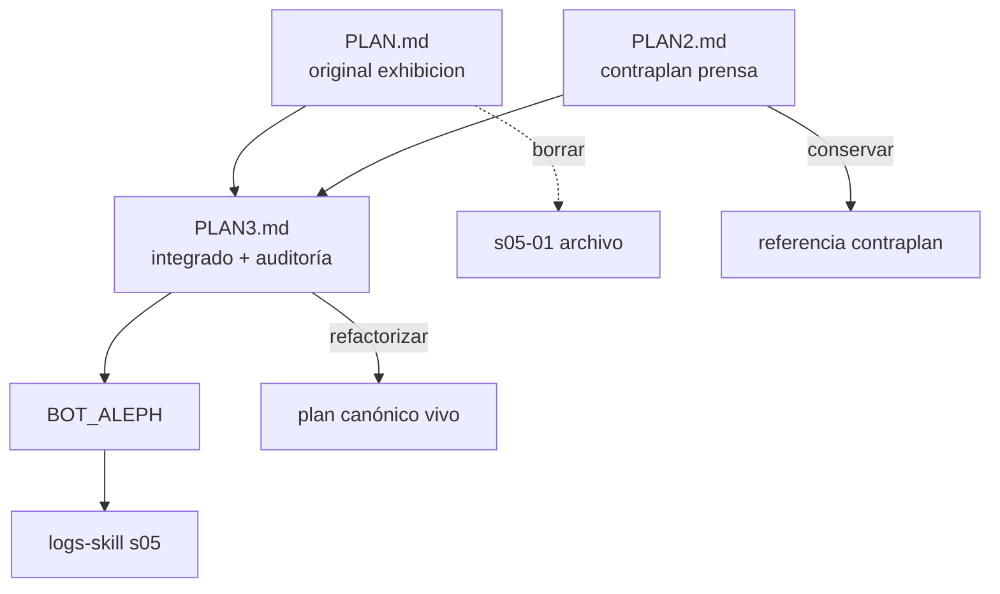
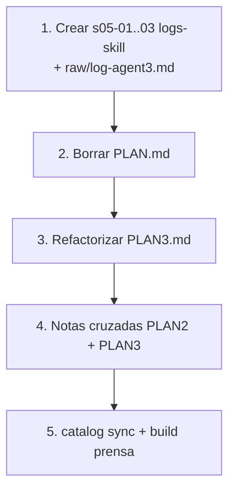

# Cierre de planes GENESIS y cuadre de logs-skill

## Alcance

- Revisar y archivar **[`GENESIS_PLAN/PLAN.md`](GENESIS_PLAN/PLAN.md)** (borrar tras bitácora).
- Auditar **[`GENESIS_PLAN/PLAN2.md`](GENESIS_PLAN/PLAN2.md)** (contraplan: prensa, loadout, traje rude-bot).
- Auditar y **refactorizar** **[`GENESIS_PLAN/PLAN3.md`](GENESIS_PLAN/PLAN3.md)** (integración PLAN+PLAN2 + inventario + deuda técnica).
- Cuadrar bitácora en [`BOT_ALEPH/logs-skill/`](BOT_ALEPH/logs-skill/).

Producto implementado: [`BOT_ALEPH/`](BOT_ALEPH/) (= repo `network-engine`).



### Roles de los tres planes

| Plan | Rol | Destino tras cierre |
|------|-----|---------------------|
| **PLAN.md** | Motor-first, portal `exhibicion/`, pipeline clásico | **Borrar** (archivo en logs-skill) |
| **PLAN2.md** | Contraplan: juego, loadout, `prensa/`, FOSS estricto | **Conservar** (historial de decisiones) |
| **PLAN3.md** | Unifica PLAN+PLAN2 + snapshot BOT_ALEPH + deuda + fases | **Conservar y refactorizar** (plan vivo) |

---

## Tabla de conflictos PLAN vs PLAN2 vs PLAN3 → código

| Tema | PLAN.md | PLAN2.md | PLAN3.md | BOT_ALEPH | Ganador |
|------|---------|----------|----------|-----------|---------|
| Portal público | `exhibicion/` | `prensa/` | `prensa/` (§6) | `public/prensa/` | **PLAN2/3** |
| Activación | Pipeline ACTIVACION | Loadout instantáneo | Loadout (§4) | `nengine loadout` parcial | **PLAN2/3** |
| Metáfora prensa | Exhibición neutral | Traje rude-bot | Traje rude-bot (§6) | `prensa/equipamiento/` | **PLAN2/3** |
| Layout `data/engines`, `data/corpus/` | Sí | Sí | Sí (§6) | In situ en raíz | **Descartado** los tres |
| `docs/sesiones/` | No (PLAN) | No | Sí (§6) | No existe | **Descartar** → `logs-skill` |
| Deuda P0 refs `.cursor`→`agents` | — | — | Sí (§7 Fase 0) | Operativos OK; raw verbatim intacto | **Hecho** (salvo raw) |
| `composer.model.md` | — | — | P0 abierto (§2) | Stub existe en raíz | **Hecho** (PLAN3 desactualizado) |
| Fase 0 «antes de network-engine» | — | — | Sí (§7) | network-engine ya existe | **Obsoleto** timing; deuda aún válida |
| CLI session / pack | Sí (PLAN) | Implícito sesiones | Sí (§5 diagrama) | Stubs | **Pendiente** los tres |

---

## Auditoría PLAN.md (plan original)

Leyenda: **Hecho** · **Parcial** · **No** · **Aplicar** · **Descartar**

### Visión, estructura, CLI

| Ítem | Estado | Decisión |
|------|--------|----------|
| Repo FOSS dual + `network_engine/` | **Hecho** | Conservar |
| `data/engines/`, `data/corpus/` | **No** | **Descartar** migración |
| `data/sessions/` | **No** | **Aplicar** |
| Portal `exhibicion/` | **No** | **Descartar** → `prensa/` |
| `nengine build`, `catalog sync` | **Hecho** | — |
| `session init/commit`, `nengine pack` | **No** | **Aplicar** |
| `foss/metodologia.html` | **No** | **Descartar** (PLAN2/3 usan `datos-publicados`) |
| Infra MEDIDOR reutilizada | **Hecho** | — |
| Paquete base compartido | **No** | **Descartar** |

### Fases §256–295

| Fase | Estado |
|------|--------|
| 1 Init + infra | **Hecho** |
| 2 Motor + CLI | **~80%** |
| 3 Datos | **~70%** |
| 4 Web | **~85%** |
| 5 Docs + publicación | **~95%** |

**Veredicto PLAN.md:** **borrable**. Divergencias absorbidas por PLAN2/PLAN3 y código.

---

## Auditoría PLAN2.md (contraplan)

### Por fases §238–263

| Fase | Ítem clave | Estado | Decisión |
|------|-----------|--------|----------|
| 0 | `PLAN-CONTRAPLAN.md` en raíz | **No** | **Descartar** ruta; vive en GENESIS_PLAN/PLAN2 |
| 0 | Dejar PLAN.md intacto | Obsoleto | PLAN.md se archiva |
| 1 | Infra MEDIDOR | **Hecho** | — |
| 2 | loadout schema + CLI | **Parcial** | **Aplicar** persistencia `apply` |
| 3 | catalog + prensa (equipamiento, engines, corpus, tablero) | **Hecho** | `prensa/sesiones/` **Aplicar** |
| 4 | FOSS estricto (llms, 6 prompts, foss pages) | **Hecho** | Revisar copyright LICENSE |
| 5 | build + Pages | **Parcial** | Deploy remoto pendiente |

### Mapeo corpus

| PLAN2 propone | Real | Decisión |
|---------------|------|----------|
| `data/engines/` | `engines/` in situ | **Descartar** mover |
| `data/corpus/` | `*-aleph/`, `logs-skill/` in situ | **Descartar** mover |

**Veredicto PLAN2:** **conservar** como registro del contraplan. Pendientes compartidos con PLAN3.

---

## Auditoría PLAN3.md (plan integrado)

PLAN3 aporta lo que PLAN y PLAN2 no tienen: **inventario snapshot**, **deuda técnica priorizada**, **diagramas**, **verification plan**. Parte del texto está **desactualizado** respecto al código actual.

### §1 — Inventario BOT_ALEPH

| Componente PLAN3 | Estado al auditar | Decisión |
|------------------|-------------------|----------|
| agents/skills/modo-aleph (6 archivos) | **Hecho** | — |
| agents/skills/linea-aleph-browser | **Hecho** | — |
| engines (8, 39 escenas) | **Hecho** | — |
| logs-aleph, sima, cima, linea (5 corpus) | **Hecho** | — |
| logs-skill (8 escenas, 4 sesiones) | **Parcial** | **Aplicar** s05 (+3 escenas) |
| aleph-context vacío | **Hecho** snapshot | **Aplicar** calibración real |
| Schemas engine + profile | **Hecho** | + loadout/session/catalog en `data/schema/` |
| eval prompts-test 01–03 | **Hecho** | reviews/ vacío **Aplicar** |
| sessions/ vacío | **Hecho** snapshot | **Aplicar** |

**Refactor PLAN3:** actualizar tabla §1 — logs-skill → 11 escenas tras s05; marcar `composer.model.md` como stub existente.

### §2 — Deuda técnica

| Deuda PLAN3 | Estado real | Decisión |
|-------------|-------------|----------|
| P0 refs `.cursor`→`agents` en operativos | **Hecho** en aleph-context; raw verbatim sin tocar | Marcar **Hecho** en refactor |
| `composer.model.md` desaparecido | **Hecho** — [`composer.model.md`](BOT_ALEPH/composer.model.md) stub | Marcar **Hecho** |
| engine-model-A anchor_scene | **Parcial** | **Aplicar** alinear engine.json con manifest |
| aleph-context vacío (hot, posicion) | Esperado | **Aplicar** tras primer turno |
| logs-skill/manifest ref `.cursor` | **Hecho** — ya `agents/skills/` | Marcar **Hecho** |

### §3–4 — Diagramas arquitectura y juego

| Ítem | Estado | Decisión |
|------|--------|----------|
| Diagrama datos BOT_ALEPH (§3) | Documentación | **Conservar** en PLAN3 |
| Diagrama juego loadout (§4) | Alineado con código | **Conservar** |
| Estructura escena segmentada | Correcta | **Conservar** |
| Tabla scripts segmentación | Correcta | **Conservar** |

### §5 — Diagrama network-engine

| Ítem PLAN3 diagrama | Estado | Decisión |
|---------------------|--------|----------|
| motor `network_engine/` completo | **Hecho** | — |
| `data/engines/`, `data/corpus/` en diagrama | **No** en disco | **Refactor** diagrama → rutas in situ |
| `docs/sesiones/` | **No** | **Descartar** o nota «→ logs-skill» |
| `prensa/sesiones/`, `downloads/` | **No** | **Aplicar** |
| `docs/prompts/` (5 en diagrama) | **Hecho** (6 con lectura_pack) | Actualizar conteo |

### §6 — Plan unificado (decisiones + estructura)

| Decisión PLAN3 §6 | Estado | Decisión |
|-------------------|--------|----------|
| `prensa/` no exhibicion | **Hecho** | — |
| Loadout instantáneo | **Parcial** | **Aplicar** |
| Traje rude-bot | **Hecho** | — |
| FOSS clon MEDIDOR | **Hecho** | — |
| `loadout.schema.json` | **Hecho** | — |
| Estructura `data/` con engines/corpus subdirs | **No** | **Descartar** en refactor → documentar layout real |

### §7 — Fases priorizadas

| Fase PLAN3 | Estado | Refactor PLAN3 |
|------------|--------|----------------|
| **Fase 0** deuda pre-network-engine | Mayoría **Hecho** | Renombrar «Fase 0 — Deuda BOT_ALEPH»; tachar ítems cerrados |
| **Fase 1** init network-engine | **Hecho** | Marcar completada |
| **Fase 2** loadout + tablero | **Parcial** | Mantener pendientes `apply` |
| **Fase 3** datos + catalog | **Hecho** | Marcar completada |
| **Fase 4** web prensa + FOSS | **Parcial** | Pendiente sesiones/downloads |
| **Fase 5** docs + publicación | **Parcial** | Pages remoto |

### §8 — Open questions

| Pregunta | Resolución | Acción refactor |
|----------|------------|-----------------|
| Qué raw publicar | Metadata + in situ + blob links | Cerrar en PLAN3 |
| composer.model.md | Stub en raíz | Cerrar |
| Serie/ARG | Abierto | Mantener pregunta |
| Ubicación repo | `BOT_ALEPH/` | Cerrar |
| ¿Arreglar refs ahora? | Hecho en operativos | Cerrar |

### §9 — Verification plan

| Verificación | Estado | Decisión |
|--------------|--------|----------|
| grep `.cursor/skills` excl. raw | Pasa en operativos | **Conservar** en PLAN3 |
| segment scripts loop | **Aplicar** ejecutar en cierre | Añadir a checklist |
| pytest + build all | **Hecho** en repo | **Conservar** |

**Veredicto PLAN3:** **conservar y refactorizar** — no borrar. Tras cierre de PLAN.md pasa a ser el **único plan vivo** con roadmap; PLAN2 queda como anexo histórico del contraplan.

### Refactor PLAN3.md (cambios concretos)

1. **§1 línea 3:** enlace PLAN.md → `archivado en logs-skill/s05-01` (no file:// externo).
2. **§1 inventario:** logs-skill 8→11 escenas; `composer.model.md` ✅ stub.
3. **§2 deuda:** marcar P0 refs y composer como resueltos; dejar engine-model-A y calibración.
4. **§5 diagrama:** `data/engines` → `engines/`; `data/corpus` → `*-aleph/` in situ.
5. **§6 estructura:** añadir nota «layout nominal vs in situ»; quitar o redirigir `docs/sesiones/`.
6. **§7 fases:** cabeceras `✅ Hecho` / `⚠️ Parcial` / `❌ Pendiente` por ítem.
7. **§8:** cerrar preguntas resueltas; dejar serie/ARG abierta.
8. **Nueva §10:** «Relación GENESIS_PLAN» — PLAN.md archivado, PLAN2 anexo, PLAN3 canónico.

---

## Matriz resumen: aplicar / descartar / hecho

| Origen | Aplicar | Descartar | Hecho |
|--------|---------|-----------|-------|
| **PLAN.md** | session, pack, sesiones catalog | exhibicion, data/corpus layout, SENSORES/, docs/sesiones/, paquete base | Infra FOSS, build, catalog, metodología |
| **PLAN2.md** | loadout apply, prensa/sesiones, pack, LICENSE | PLAN-CONTRAPLAN raíz, migración data/ | prensa, loadout schema, prompts, foss |
| **PLAN3.md** | refactor doc, engine-model-A, eval reviews, segment verify | docs/sesiones/, layout data/ nominal, Fase 0 timing | inventario, diagramas, decisiones §6, mayoría Fases 1–3 |
| **Transversal** | Sesiones tablero E2E, calibración aleph-context | — | ~75–80% network-engine |

---

## Veredictos de borrado / conservación

| Fichero | Acción |
|---------|--------|
| **PLAN.md** | **Borrar** tras logs-skill s05-01 |
| **PLAN2.md** | **Conservar** + nota «PLAN.md archivado» |
| **PLAN3.md** | **Conservar + refactorizar** → plan canónico |

---

## Cuadre de bitácora en logs-skill

### Gap

- s01–s04 cubren diseño corpus/skill; **sin** genesis ni cierre de los tres planes.
- [`segment_skill_log.py`](BOT_ALEPH/logs-skill/segment_skill_log.py) solo consume `log-agent1.md` (8 escenas).

### Sesión 05 — tres escenas

```
logs-skill/
├── raw/log-agent3.md                    (síntesis auditoría triple)
└── sesion-05-genesis-network-engine/
    ├── 01-cierre-plan-md/               s05-01
    ├── 02-estado-plan2-contraplan/      s05-02
    └── 03-auditoria-refactor-plan3/     s05-03
```

| ID | Título | Contenido `output.md` |
|----|--------|----------------------|
| **s05-01** | Archivo GENESIS_PLAN/PLAN.md | Auditoría PLAN.md + veredicto borrado |
| **s05-02** | PLAN2 vs BOT_ALEPH | Fases contraplan Hecho/Aplicar/Descartar |
| **s05-03** | PLAN3 integrado + refactor | Inventario, deuda, fases; lista cambios refactor PLAN3 |

Tags s05: `genesis`, `network-engine`, `GENESIS_PLAN`, `archivo`, `auditoria`

Anomalías: `plan_md_supersedido_por_plan2_plan3`; `plan3_snapshot_desactualizado_pre_refactor`

Implementación **manual** (no tocar `segment_skill_log.py` ni `log-agent1.md`).

---

## Orden de ejecución



---

## Resumen ejecutivo

| Acción | Qué |
|--------|-----|
| **Borrar** | [`GENESIS_PLAN/PLAN.md`](GENESIS_PLAN/PLAN.md) |
| **Conservar** | [`PLAN2.md`](GENESIS_PLAN/PLAN2.md) (anexo contraplan) |
| **Conservar + refactorizar** | [`PLAN3.md`](GENESIS_PLAN/PLAN3.md) (plan canónico vivo) |
| **Cuadre bitácora** | sesión-05 con **tres escenas** (PLAN + PLAN2 + PLAN3) |
| **Aplicar después** | loadout apply, session/pack, prensa/sesiones, engine-model-A, eval reviews |
