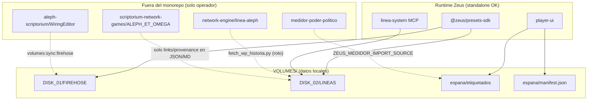

# Informe de investigación: `VOLUMES/` y referencias legacy

## Veredicto sobre la afirmación previa

> *"VOLUMES/ — muchos ../../medidor-poder-politico, scriptorium-network-games/ALEPH_ET_OMEGA, y metadatos legacy (linea-poder, linea-aleph) en datos sincronizados."*

**Parcialmente cierta, con matices importantes:**

| Afirmación | Realidad en disco |
|------------|-------------------|
| `../../medidor-poder-politico` | **No aparece** como ruta relativa en `VOLUMES/`. Solo en informes/scripts externos (`medidor-poder-politico` como nombre de repo en `.env.example`, `MEDIDOR_SYNC_REPORT.md`, `scripts/volumes-init-medidor.mjs`). Los **datos** del medidor ya viven en `espana/etiquetados/` (ruta interna). |
| `scriptorium-network-games/ALEPH_ET_OMEGA` | **Sí**, en ~13 archivos: manifest, INDICE, Python, README, JSON de etiquetados (como provenance). |
| `linea-poder` / `linea-aleph` | **Sí**, pero sobre todo como **metadatos históricos** y documentación de operador; un script Python tiene dependencia runtime rota hacia `linea-aleph`. |
| "muchos `../../`" | **Mixto**: muchos `../../` son navegación **válida dentro de VOLUMES**; los que apuntan fuera del monorepo son pocos pero críticos para sync/operador. |

---

## 1. Resultados por patrón de búsqueda

### `medidor-poder-politico` / `medidor`

| Archivo | Línea / contenido | Clasificación | ¿Resuelve fuera del monorepo? |
|---------|-------------------|---------------|-------------------------------|
| `VOLUMES/DISK_02/LINEAS/espana/etiquetados/MEDIDOR_SYNC_REPORT.md` | "Medidor **motor** … remains in external `medidor-poder-politico` repo" | Informe generado | No (solo texto) |
| `VOLUMES/DISK_02/LINEAS/espana/manifest.json` | `"medidor": "etiquetados"` | JSON metadata | **No** — ruta relativa interna |
| `VOLUMES/DISK_02/LINEAS/espana/segment_poder.py` | `MEDIDOR_LINK = "etiquetados"` | Script Python operador | **No** |
| `VOLUMES/DISK_02/LINEAS/registry.yaml` | `medidor_linea_ref: linea_id` | YAML contrato | No |
| `VOLUMES/DISK_02/LINEAS/README.md` | referencia al medidor en `data/casos/` | Documentación | No |
| Varios en `etiquetados/**` (prensa, cuerpo.html) | menciones narrativas al "medidor FOSS" | Contenido editorial | No |

**Fuera de VOLUMES pero relacionado:** `.env.example` → `ZEUS_MEDIDOR_IMPORT_SOURCE=C:/path/to/medidor-poder-politico/data/casos`

---

### `scriptorium-network-games` / `ALEPH_ET_OMEGA`

| Archivo | Contenido | Clasificación | Resolución desde ubicación del archivo |
|---------|-----------|---------------|----------------------------------------|
| `espana/manifest.json:71` | `"arg": "../../../scriptorium-network-games/ALEPH_ET_OMEGA/index.md"` | JSON metadata | → `VOLUMES/scriptorium-network-games/...` (**ruta inexistente**, no sale del monorepo) |
| `espana/segment_poder.py:34` | `ARG_LINK = "../../../scriptorium-network-games/..."` | Script generador | Igual → `DISK_02/scriptorium-network-games/...` |
| `DISK_02/LINEAS/INDICE.md:12` | `../../scriptorium-network-games/...` | Doc markdown | → `VOLUMES/scriptorium-network-games/...` |
| `espana/INDICE.md:56` | `../../../scriptorium-network-games/...` | Doc markdown (generado) | → `DISK_02/scriptorium-network-games/...` |
| `espana/wp/historia/README.md:60-61` | `../../../../../scriptorium-network-games/...` | Doc markdown | → `VOLUMES/scriptorium-network-games/...` |
| `etiquetados/**/meta.json` (×4) | `"prompt_analisis": "scriptorium-network-games/ALEPH_ET_OMEGA/agentchain/..."` | JSON metadata importado | String de provenance, **no es path filesystem** |
| `etiquetados/**/caso*.json`, `cribados/*.json`, `p24_mediciones.json` | `"Fuente: scriptorium-network-games/ALEPH_ET_OMEGA/raw/lore.md"` | JSON datos sincronizados | Provenance textual |
| `wp/historia/cache/viajes/2026-07-07-viaje1.json` | `"contexto": "viaje piloto block-4 ALEPH_ET_OMEGA"` | JSON operador | Solo etiqueta |

Los INDICE también enlazan la URL GitHub (válida): `https://github.com/alephscriptorium-eng/scriptorium-network-games/tree/main/ALEPH_ET_OMEGA`

---

### `linea-poder` / `linea-aleph`

| Archivo | Contenido | Clasificación | Resolución |
|---------|-----------|---------------|------------|
| `espana/wp/historia/raw/linea.json:6` | `"corpus_dir": "network-engine\\linea-poder\\wp\\historia"` | JSON legacy en datos migrados | **No se usa en runtime** Zeus |
| `espana/wp/historia/raw/linea.md:6` | "v0 bootstrap linea-poder" | Texto generado | Provenance |
| `wp/historia/manifest.json`, `manifest.draft.json` | texto con "linea-poder" | JSON generado | Provenance en campo `text` |
| `espana/fetch_wp_historia.py:17` | `LINEA_ALEPH = ROOT.parent.parent / "linea-aleph"` | **Script operador — runtime-crítico al ejecutarlo** | → `VOLUMES/DISK_02/linea-aleph` (**no existe**) |
| `espana/wp/historia/README.md` | `cd ../../linea-aleph`, `../../../linea-aleph/CACHE_RUNBOOK.md` | Doc operador | Rutas **incorrectas** desde `wp/historia/` |
| `CACHE_RUNBOOK-PODER.md:152` | "Portado desde `network-engine/linea-aleph/CACHE_RUNBOOK.md`" | Doc | Provenance |
| `segment_poder.py`, `INDICE.md` | comentarios "desde linea-aleph" | Doc generada | Solo texto |
| `etiquetados/**` (×11 archivos) | `"Fuente: network-engine/lineas-poder/espana/nodos/Pxx/meta.json"` | JSON datos | Provenance textual del árbol antiguo |

---

### `network-engine` / `aleph-scriptorium` / `WiringEditor`

| Archivo | Contenido | Clasificación | Resolución |
|---------|-----------|---------------|------------|
| `VOLUMES/volumes.json:11` | `"defaultRemotePath": "../../../aleph-scriptorium/WiringEditor/data/firehose"` | **Config sync — operador** | Desde `zeus-presets-sdk` → `OASIS/aleph-scriptorium/WiringEditor/data/firehose` (**fuera del monorepo**) |
| `DISK_01/FIREHOSE_SYNC_REPORT.md` | rutas absolutas a `aleph-scriptorium\WiringEditor\data\firehose` | Informe generado | Documenta sync real |
| `VOLUMES/README.md:21` | mención read-only del pipeline WiringEditor | Doc | Texto |
| Sync reports | paths con `network-engine/zeus-presets-sdk/VOLUMES/...` | Informes | Metadatos de máquina local |

---

### `LINEAS_LEGACY` / `corpus_dir` / `legacy`

| Archivo | Contenido | Clasificación |
|---------|-----------|---------------|
| `volumes.json:48` | `"legacyRemovedAt": "2026-07-09T19:50:00Z"` | Metadata de migración |
| `VOLUMES/README.md`, `LINEAS_SYNC_REPORT.md` | `LINEAS_LEGACY_SOURCE` + `volumes:init:lineas -- --import` | Doc / informe |
| `fetch_wp_historia.py:104` | escribe `corpus_dir` relativo a `DISK_02` al re-ejecutar | Script (nuevo valor sería `espana/wp/historia`) |
| `linea.json` | `corpus_dir` legacy `network-engine\linea-poder\...` | Dato migrado sin actualizar |
| `DISK_01/FIREHOSE/**` (×8 JSON) | palabra "legacy" en textos de posts EN | **Ruido** — no relacionado con el proyecto |

---

### Rutas `../../` y `../../../`

**Válidas (dentro de VOLUMES):** navegación entre `wp/historia` ↔ `espana` ↔ `LINEAS` (manifest, nodos.yaml, etiquetados internos).

**Problemáticas:**

| Ruta relativa | Desde | Resuelve a | ¿Fuera monorepo? |
|---------------|-------|------------|------------------|
| `../../../aleph-scriptorium/WiringEditor/data/firehose` | `zeus-presets-sdk` (MONOREPO_ROOT) | `OASIS/aleph-scriptorium/...` | **Sí** |
| `../../../scriptorium-network-games/...` | `espana/` | `VOLUMES/scriptorium-network-games/...` | No, pero **inexistente** |
| `../../scriptorium-network-games/...` | `LINEAS/` | `VOLUMES/scriptorium-network-games/...` | No, pero **inexistente** |
| `../../linea-aleph` | `wp/historia/README` (bash) | `espana/linea-aleph` | No, **inexistente** |
| `ROOT.parent.parent / "linea-aleph"` | `fetch_wp_historia.py` | `DISK_02/linea-aleph` | No, **inexistente** |
| `../agents/skills/linea-volume-browser/SKILL.md` | `LINEAS/INDICE.md` | `DISK_02/agents/skills/...` | No, **inexistente** |

---

## 2. Archivos clave leídos

### `VOLUMES/volumes.json`
- Registra `firehose` (DISK_01) y `lineas` (DISK_02).
- Firehose: `defaultRemotePath` apunta a `aleph-scriptorium/WiringEditor` vía `../../../`.
- Lineas: `legacyRemovedAt` confirma migración completa; sin `defaultSourcePath` legacy en disco.

### `VOLUMES/README.md`
- Política explícita: **`DISK_02/LINEAS` es la única raíz de lectura** para lineas.
- Re-import opcional vía `LINEAS_LEGACY_SOURCE` (env var, no path hardcoded).
- `VOLUMES/` gitignored en `network-engine/.gitignore`.

### `espana/manifest.json`
```json
"links": {
  "medidor": "etiquetados",           // interno ✓
  "arg": "../../../scriptorium-network-games/ALEPH_ET_OMEGA/index.md",  // roto
  "wp_cima": "https://es.wikipedia.org/wiki/Historia_de_España"
}
```

### `fetch_wp_historia.py`
- Intenta importar `history_common` desde `DISK_02/linea-aleph/scripts` — **roto en standalone**.
- Existe `DISK_02/LINEAS/scripts/mw_client.py` local, pero **no** `history_common.py`.
- Al re-ejecutar, `corpus_dir` se escribiría correctamente como ruta relativa bajo `DISK_02`.

### `segment_poder.py`
- Genera `manifest.json`, `INDICE.md`, `nodos/Pxx/meta.json`.
- Hardcodea `ARG_LINK` externo; `MEDIDOR_LINK = "etiquetados"` (interno).

---

## 3. ¿Lee el runtime Zeus estas rutas?

### `@zeus/presets-sdk` — **Sí, pero solo rutas internas**

| API | Lee | Ignora |
|-----|-----|--------|
| `resolveVolumesRoot()` | `ZEUS_VOLUMES_ROOT` → `VOLUMES/` | — |
| `resolveVolume('lineas')` | `DISK_02/LINEAS` | paths legacy |
| `resolveMedidorCasosPath('espana')` | `DISK_02/LINEAS/espana/etiquetados` | repo `medidor-poder-politico` |
| `resolveVolume('firehose').source.remotePath` | `ZEUS_FIREHOSE_REMOTE_PATH` o `defaultRemotePath` | solo en **sync**, no en browse runtime |

**No hay ningún grep en `packages/`** que lea `manifest.meta.links.arg`, `links.medidor`, `corpus_dir`, ni `prompt_analisis`.

### `packages/linea-system` — **Sí, datos internos**
- Lee `manifest.json` (nodos, `meta.satelite_wp`, `meta.partes`, `meta.autor_tronco`).
- No consume `meta.links`.

### `packages/player-ui` (`aleph-bridge.mjs`) — **Sí, datos internos**
- `manifest.json`, `registry.yaml`, `espana/etiquetados/{caso}/estado.json`.
- `resolveMedidorCasosPath()` — hardcoded a `espana/etiquetados`, **no** lee `manifest.links.medidor`.
- Endpoint `/api/aleph/view-links` usa `manifest.meta.satelite_wp`, no links externos.

### Scripts operador (fuera de `packages/` pero parte del SDK)
- `volumes-init-lineas.mjs` — verifica/importa a `DISK_02/LINEAS`; import vía `ZEUS_LINEAS_IMPORT_SOURCE`.
- `volumes-init-medidor.mjs` — verifica/importa a `etiquetados`; import vía `ZEUS_MEDIDOR_IMPORT_SOURCE`.
- `volumes-sync-firehose.mjs` — **sí depende** de ruta externa WiringEditor para re-sync.

**Conclusión runtime:** el Tablero, MCP linea-system y browse API funcionan en monorepo standalone **siempre que `VOLUMES/DISK_*` esté poblado**. Las referencias legacy no bloquean la ejecución normal.

---

## 4. Conteo de archivos por categoría

Estimación basada en `volumes.json`, informes de sync y exploración del árbol (~9.900+ archivos totales):

| Categoría | Cantidad aprox. | Notas |
|-----------|-----------------|-------|
| **JSON datos** (firehose stream) | ~8.387 | `candidate` 605 + `raw` 4076 + `discarded` 3706 (`volumes.json`) |
| **JSON metadata lineas** | ~150+ | manifest, nodos P01–P24, etiquetados, cache meta, audits |
| **Markdown documentación** | ~15 core | README, INDICE, CACHE_RUNBOOK, SYNC_REPORTS |
| **Markdown generado** (registros WP) | ~7.000+ | `wp/historia/registros/**/registro.md`, `delta.md` |
| **Python operador** | 8 | `segment_poder.py`, `fetch_wp_historia.py`, `scripts/*.py` |
| **YAML** | 2 | `registry.yaml`, `nodos.yaml` |
| **Informes SYNC generados** | 3 | FIREHOSE, LINEAS, MEDIDOR |
| **Wikitext cache** | ~20+ | `cache/snapshots/*.wikitext` |
| **HTML prensa** | pocos | `etiquetados/**/cuerpo.html` |

`LINEAS_SYNC_REPORT.md` (2026-07-09) documentaba 2.060 archivos / 16.8 MB en LINEAS; el árbol actual es mayor por registros y etiquetados importados.

---

## 5. Qué se rompe en monorepo standalone

### Rompe (operador / sync / docs)

| Elemento | Impacto |
|----------|---------|
| `volumes-sync-firehose` sin `ZEUS_FIREHOSE_REMOTE_PATH` | Re-sync desde `aleph-scriptorium` falla si no existe en `OASIS/` |
| `fetch_wp_historia.py` | No ejecutable sin copiar `linea-aleph/scripts/history_common.py` o reescribir imports hacia `LINEAS/scripts/` |
| Enlaces markdown a `scriptorium-network-games`, `linea-aleph`, `agents/skills` | Links rotos en IDE/GitHub preview |
| `segment_poder.py` → regenera `ARG_LINK` roto en manifest/INDICE | Re-generación propaga paths incorrectos |

### No rompe (runtime Zeus)

| Elemento | Por qué es seguro |
|----------|-------------------|
| `manifest.links.arg` | No leído por código |
| `corpus_dir` legacy en `linea.json` | No leído por código |
| `prompt_analisis` en prensa | No leído por código |
| Strings "Fuente: network-engine/lineas-poder/..." | Provenance en texto de buffers |
| `medidor-poder-politico` como nombre de repo | Solo en informes; datos ya en `etiquetados/` |

---

## 6. Provenance histórico vs. dependencia real

| Tipo | Ejemplos | Acción sugerida |
|------|----------|-----------------|
| **Provenance seguro** | "Fuente: network-engine/lineas-poder/...", "Fuente: scriptorium-network-games/...", "v0 bootstrap linea-poder" en textos | **Dejar** o normalizar a URLs GitHub en una pasada futura |
| **Metadata obsoleta** | `linea.json` → `corpus_dir: network-engine\linea-poder\...` | **Reescribir** a `espana/wp/historia` al próximo refresh |
| **Links rotos en manifest** | `links.arg` relativo | **Reescribir** a URL GitHub o eliminar campo si no se usa |
| **Dependencia operador** | `fetch_wp_historia.py` → `linea-aleph` | **Copy-in** de `history_common.py` a `LINEAS/scripts/` o env var `LINEA_ALEPH_SCRIPTS` |
| **Sync externo** | firehose defaultRemotePath | **Env var** `ZEUS_FIREHOSE_REMOTE_PATH` (ya soportado) |
| **Import externo** | medidor/lineas legacy | **Env vars** `ZEUS_MEDIDOR_IMPORT_SOURCE`, `ZEUS_LINEAS_IMPORT_SOURCE` (ya soportado) |
| **Generador** | `segment_poder.py` ARG_LINK | **Reescribir** a URL GitHub en próxima ejecución del script |

---

## 7. Recomendaciones priorizadas

### P0 — Sin impacto en runtime actual
1. **Dejar** strings de provenance en JSON de etiquetados (documentan origen de buffers MCS).
2. **Dejar** `MEDIDOR_SYNC_REPORT.md` y política de motor externo en `medidor-poder-politico`.

### P1 — Higiene de paths (evitar confusión)
3. **`manifest.json` + `segment_poder.py`:** cambiar `links.arg` de path relativo roto → URL GitHub del ARG.
4. **`linea.json` / manifests WP:** actualizar `corpus_dir` y textos "linea-poder" → `LINEAS/espana/wp/historia`.
5. **INDICE.md / README:** sustituir `../../scriptorium-network-games` por URLs; corregir `cd ../../linea-aleph` (doc incorrecta).

### P2 — Operador standalone
6. **`fetch_wp_historia.py`:** apuntar a `LINEAS/scripts/` (ya tiene `mw_client.py`; falta portar `history_common.py`).
7. **Firehose sync:** documentar que standalone requiere `ZEUS_FIREHOSE_REMOTE_PATH` o datos ya copiados en `DISK_01/FIREHOSE`.
8. **`INDICE.md` skill link:** apuntar a `agents/skills/...` en raíz del monorepo, no `DISK_02/agents/`.

### P3 — Opcional
9. Eliminar campo `links.arg` del manifest si se confirma que ningún consumidor futuro lo necesita.
10. Añadir nota en `VOLUMES/README.md` listando explícitamente qué referencias son históricas vs. operativas.

---

## 8. Diagrama de dependencias



---

## Resumen ejecutivo

La carpeta `VOLUMES/` **sí contiene metadatos legacy** (`linea-poder`, `linea-aleph`, rutas `network-engine/...`, referencias al ARG) principalmente en datos importados y documentación. **No** contiene rutas `../../medidor-poder-politico`; el medidor ya está materializado en `espana/etiquetados/`.

El runtime Zeus (`presets-sdk`, `player-ui`, `linea-system`) **no lee** esos paths externos: solo `DISK_02/LINEAS`, `espana/etiquetados`, y `DISK_01/FIREHOSE`. Lo que sí falla en standalone es la **herramienta de operador** (`fetch_wp_historia.py`, re-sync firehose, enlaces markdown rotos) — no el Tablero en ejecución con datos ya sincronizados.